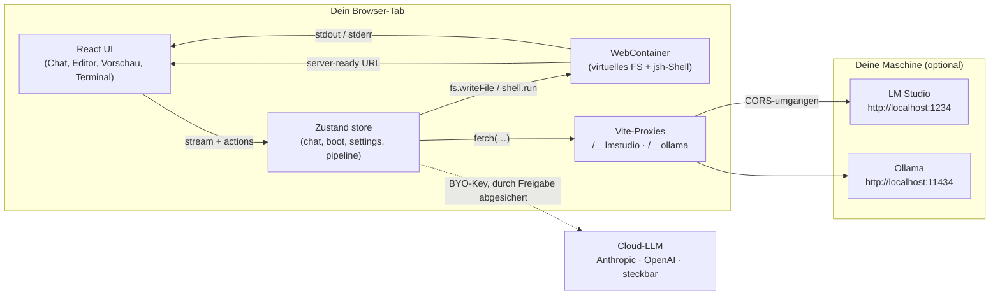
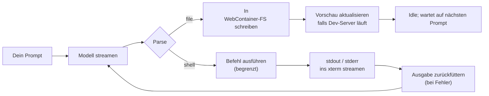

# 🧙‍♂️⚡ BoltWizard

<a id="about-the-creator"></a>
<a id="terms-of-service"></a>
<a id="privacy-policy"></a>

> **Ein Zaubererhut mit Blitz. Baue Full-Stack-Apps im Browser — Local-First, agentisch, einsehbar.**

<sub>Erstellt von **Mohammad Saeed Angiz** · [Über den Ersteller](#about-the-creator) · [Nutzungsbedingungen](#terms-of-service) · [Datenschutzerklärung](#privacy-policy)</sub>

<div align="center">

<svg xmlns="http://www.w3.org/2000/svg" viewBox="0 0 220 96" width="440" height="192" role="img" aria-label="BoltWizard — animierter Held">
  <defs>
    <radialGradient id="boltGrad" cx="50%" cy="50%" r="50%">
      <stop offset="0%" stop-color="#FCD34D" stop-opacity="1"/>
      <stop offset="70%" stop-color="#FBBF24" stop-opacity="0.9"/>
      <stop offset="100%" stop-color="#F59E0B" stop-opacity="0"/>
    </radialGradient>
    <linearGradient id="hatGrad" x1="0" y1="0" x2="0" y2="1">
      <stop offset="0%" stop-color="#8B5CF6"/>
      <stop offset="100%" stop-color="#5B21B6"/>
    </linearGradient>
    <filter id="glow" x="-50%" y="-50%" width="200%" height="200%">
      <feGaussianBlur stdDeviation="2.5" result="blur"/>
      <feMerge><feMergeNode in="blur"/><feMergeNode in="SourceGraphic"/></feMerge>
    </filter>
  </defs>
  <circle cx="50" cy="48" r="46" fill="url(#hatGrad)" opacity="0.06">
    <animate attributeName="r" values="46;52;46" dur="3.6s" repeatCount="indefinite"/>
    <animate attributeName="opacity" values="0.06;0.12;0.06" dur="3.6s" repeatCount="indefinite"/>
  </circle>
  <path d="M50 8 L88 70 L12 70 Z" fill="url(#hatGrad)" filter="url(#glow)"/>
  <ellipse cx="50" cy="72" rx="42" ry="9" fill="#5B21B6"/>
  <ellipse cx="50" cy="71" rx="40" ry="7" fill="#6D28D9"/>
  <rect x="14" y="64" width="72" height="6" rx="2" fill="#7C3AED"/>
  <g filter="url(#glow)">
    <path d="M56 14 L34 42 L46 42 L40 64 L62 32 L48 32 Z" fill="#FBBF24">
      <animate attributeName="opacity" values="0.85;1;0.85" dur="1.2s" repeatCount="indefinite"/>
    </path>
  </g>
  <circle cx="50" cy="40" r="14" fill="url(#boltGrad)" opacity="0">
    <animate attributeName="r" values="10;26;10" dur="1.4s" repeatCount="indefinite"/>
    <animate attributeName="opacity" values="0.7;0;0.7" dur="1.4s" repeatCount="indefinite"/>
  </circle>
  <text x="104" y="48" font-family="ui-sans-serif, system-ui, -apple-system, Segoe UI, Roboto" font-size="34" font-weight="700" fill="#5B21B6">Bolt</text>
  <text x="166" y="48" font-family="ui-sans-serif, system-ui, -apple-system, Segoe UI, Roboto" font-size="34" font-weight="700" fill="#FBBF24">Wizard</text>
  <text x="104" y="68" font-family="ui-sans-serif, system-ui, -apple-system, Segoe UI, Roboto" font-size="11" fill="#475569">in-browser AI dev agent · local-first · multi-provider LLM</text>
</svg>

</div>

<div align="center">

> **Beschreibe eine App im Chat. Ein lokales oder Cloud-LLM schreibt die Dateien, installiert Abhängigkeiten und führt eine Live-Vorschau aus — komplett in deinem Browser.**

</div>

<p align="center">
  
</p>
<p align="center"><sub>↑ Echtes Chat-Streaming · Prompt → Assistentenantwort → <code>&lt;boltAction&gt;</code>-Blöcke → Terminal-Tail.</sub></p>

---

## Inhaltsverzeichnis

- [🪄 Was ist BoltWizard?](#what-is-boltwizard)
- [🏆 Warum es das Beste ist](#why-its-the-best)
  - [1. Local-First standardmäßig](#1-local-first-by-default)
  - [2. Echte Sandbox: WebContainers](#2-real-sandbox-webcontainers)
  - [3. Austauschbare LLM-Anbieter](#3-pluggable-llm-providers)
  - [4. Begrenzte, einsehbare Agent-Schleife](#4-bounded-inspectable-agent-loop)
  - [5. Überwachte Multi-Agent-Pipeline (optional)](#5-supervised-multi-agent-pipeline-optional)
  - [6. Cross-Origin-Isolation, richtig gemacht](#6-cross-origin-isolation-done-right)
  - [7. Die Marke ist ein Feature](#7-the-brand-is-a-feature)
  - [8. Offen und einsehbar](#8-open-and-inspectable)
- [🧱 Architektur](#architecture)
- [🔁 Die Agent-Schleife (animiert)](#the-agent-loop-animated)
- [🛠 So benutzt du es](#how-to-use-it)
  - [Installation & erster Start](#install--first-boot)
  - [Ein LLM konfigurieren](#configure-an-llm)
  - [Der tägliche Ablauf](#the-daily-flow)
  - [Leistungsmerkmale](#power-features)
  - [Export & Wiederherstellung](#export--recovery)
- [🔌 Anbieter-Matrix](#provider-matrix)
- [🛡 Datenschutz by Design](#privacy-by-design)
- [🩺 Fehlerbehebung](#troubleshooting)
- [⌨️ Befehls-Spickzettel](#commands-cheat-sheet)
- [🧠 Funktionen auf einen Blick](#-features-at-a-glance)
- [🧾 Über den Ersteller](#about-the-creator)
- [📜 Nutzungsbedingungen](#terms-of-service)
- [🔒 Datenschutzerklärung](#privacy-policy)
- [📝 Lizenz](#license)

---

<a id="what-is-boltwizard"></a>

## 🪄 Was ist BoltWizard?

BoltWizard ist ein **KI-Entwicklungsagent im Browser**. Öffne die URL, beschreibe was du bauen willst, und sieh zu, wie der Agent ein echtes, mehrteiliges Projekt in eine Linux-artige Sandbox in deinem Tab streamt. Es installiert npm-Pakete, startet einen Dev-Server und lädt die Live-Vorschau in einem iframe — alles auf einer Seite.

Die App ist gebaut mit **Vite 6 + React 18 + TypeScript + Zustand + Monaco + xterm + `@webcontainer/api`**, und vertritt eine **Local-First**-Haltung: Mit LM Studio oder Ollama auf deiner Maschine verlässt **nichts dein Gerät**. Bei einem Cloud-Modell siehst du den Anbieter, die Payload und die Kosten — und genehmigst die Anfrage, bevor sie rausgeht.

---

<a id="why-its-the-best"></a>

## 🏆 Warum es das Beste ist

Die acht Vorteile, die BoltWizard wirklich anders machen als ein „Chat-UI auf Code":

### 1. Local-First standardmäßig

Die meisten „KI-Coding"-Tools laden deinen Prompt, deine Dateien und deine Ausgabe auf den Server eines anderen hoch. BoltWizards Standard-Modus betreibt die **Sandbox in deinem Tab** und das **LLM auf deiner Maschine**. Dein Code, deine Prompts, deine Daten — bis du absichtlich eine Cloud-Übergabe genehmigst.

### 2. Echte Sandbox: WebContainers

Im Inneren startet BoltWizard einen **WebContainer** — eine Linux-artige, im-Browser-Laufzeitumgebung von [WebContainers](https://webcontainers.io). Sie führt `npm install` aus, startet einen echten Dev-Server und gibt die URL an das Vorschau-iframe weiter. Ein Neuladen startet eine frische Instanz; Dateien, Einstellungen und Chat-Verlauf des Editors leben in `localStorage` und überstehen Reloads.

<!-- Mini-Diagramm: Sandbox-Grenze -->
<svg xmlns="http://www.w3.org/2000/svg" viewBox="0 0 600 140" width="600" height="140" role="img" aria-label="WebContainer-Sandbox-Grenze">
  <defs>
    <linearGradient id="box" x1="0" y1="0" x2="0" y2="1">
      <stop offset="0%" stop-color="#312E81"/>
      <stop offset="100%" stop-color="#1E1B4B"/>
    </linearGradient>
  </defs>
  <rect x="20" y="20" width="560" height="100" rx="14" fill="url(#box)"/>
  <rect x="20" y="20" width="560" height="100" rx="14" fill="none" stroke="#7C3AED" stroke-width="2" stroke-dasharray="6 4">
    <animate attributeName="stroke-dashoffset" values="0;-20" dur="1.5s" repeatCount="indefinite"/>
  </rect>
  <text x="40" y="48" font-family="ui-monospace, SFMono-Regular, Menlo" font-size="11" fill="#A78BFA">/workspace (WebContainer)</text>
  <g font-family="ui-monospace, SFMono-Regular, Menlo" font-size="12" fill="#E0E7FF">
    <text x="40" y="74">src/</text>
    <text x="40" y="92">node_modules/</text>
    <text x="40" y="110">package.json</text>
    <text x="220" y="74">package-lock.json</text>
    <text x="220" y="92">vite.config.ts</text>
    <text x="220" y="110">index.html</text>
  </g>
  <text x="430" y="92" font-family="ui-sans-serif, system-ui" font-size="11" fill="#FCD34D">↳ dev server (server-ready)</text>
</svg>

### 3. Austauschbare LLM-Anbieter

BoltWizard spricht **Anthropic** und jeden **OpenAI-kompatiblen** Endpunkt — inklusive **lokaler** LM-Studio- und Ollama-Server. Schlüssel und Anbieter-Einstellungen leben in deinem `localStorage`, niemals auf einem BoltWizard-Server.

### 4. Begrenzte, einsehbare Agent-Schleife

Jede Modellantwort wird nach `<boltAction>`-Blöcken geparst:

```
<boltAction type="file" path="src/App.tsx">…vollständiger Dateiinhalt…</boltAction>
<boltAction type="shell">npm install</boltAction>
```

Dateipfade werden gegen `..`, Laufwerksbuchstaben und Shell-unsichere Zeichen gehärtet (`src/lib/safePath.ts`). Shell-Befehle laufen mit hartem Timeout. Die Ausgabe wird dir gezeigt, dem Modell zurückgespielt und bei Fehlschlag **einmal** erneut versucht — dann stoppt die Schleife und wartet auf dich. **Keine Endlosschleifen. Keine stillen Wiederholungen.**

### 5. Überwachte Multi-Agent-Pipeline (optional)

Öffne die **Supervised pipeline**-Schublade, um den Single-Agent-Chat zu erweitern. Die Pipeline hat vier Phasen, vier Rollen und menschliche Genehmigungs-Gates an jedem Schritt:

| Phase | Rolle | Was passiert |
|---|---|---|
| **Brainstorm** | `referent` | Konversationelle Klärungs-Q&A zum Ziel. |
| **Plan-Review** | `referent` | Wandelt das Gespräch in eine **Project Instruction File (PIF)**. |
| **Build** | `coder` | Generiert eine Datei nach der anderen, parsed → schreibt → führt aus → iteriert bis `maxIterations`. |
| **Guardian-Review** | `guardian` | Audits pro Datei + abschließende ganzheitliche Prüfung gegen die PIF. |
| **Done** | `supervisor` | Zeigt Kosten, Token-Verbrauch und verbliebene Bedenken. |

Du kannst **pro Rolle Anbieter und Modelle konfigurieren** — ein winziges lokales Modell für Brainstorming und ein starkes Cloud-Modell nur für den Planungsschritt.

### 6. Cross-Origin-Isolation, richtig gemacht

`SharedArrayBuffer` ist durch `COOP: same-origin` + `COEP: require-corp` abgesichert. Ohne diese Header verweigern WebContainers den Start. Fast jedes „bolt.new-Klon"-Tutorial liefert ohne diese aus und bricht in Produktion stillschweigend. BoltWizard setzt sie in `vite.config.ts` für Dev und nutzt dieselben Header in Produktion — damit funktioniert die Vorschau **einfach**.

### 7. Die Marke ist ein Feature

Der Zaubererhut + Blitz ist keine Deko. Es ist ein Vertrag:

- **Der Hut** = die Guardrails des Agenten: überwachte Pipeline, Pfad-Validierer, Iterations-Caps.
- **Der Blitz** = das Modell: stream-schnell wenn lokal, eskaliert-bei-Genehmigung wenn nicht.
- **Die zwei Farben** (violett + elektrisch gelb) machen das In-App-Wortmarken-Paar **`Bolt` | `Wizard`** auf einen Blick erkennbar.

### 8. Offen und einsehbar

- Jeder Datei-Write ist eine sichtbare **ActionCard** im Chat-Panel.
- Das xterm-Terminal spiegelt die In-Container-Shell live.
- Die Pipeline-Schublade zeigt, was jeder Agent erhalten, entschieden und geschrieben hat.
- Alles ist Open Source zum Lesen.

---

<a id="architecture"></a>

## 🧱 Architektur

Die Laufzeit ist absichtlich schlank. Jede schwere Anforderung sitzt hinter einem kleinen, austauschbaren Modul.



Der Stack im Detail:

| Schicht | Verantwortlichkeit | Code |
|---|---|---|
| **UI-Shell** | Layout, Panels, Theme, hash-geroutete Rechtsseiten | `src/App.tsx`, `src/components/*` |
| **State** | Single Source of Truth; Selektoren + Actions | `src/store.ts` |
| **Sandbox** | WebContainer-Boot, VFS, Shell, Dev-Server-URL-Extraktion | `src/lib/webcontainer.ts` |
| **Agent-Schleife** | Stream → Parse → Write → Run → Re-Feed → gedeckelter Retry | `src/lib/agent.ts` + `tools.ts` |
| **Pipeline** | Brainstorm → PIF → Build → Guardian → Done; Freigabe-Gates | `src/lib/pipeline/*` |
| **LLM-Client** | Vereinheitlichter Streaming-Client für Anthropic + OpenAI-kompatibel | `src/lib/llm/client.ts` |
| **Provider** | Settings + Discovery (auto-bestes geladenes LM-Studio-Modell) | `src/lib/llm/providers.ts` |

---

<a id="the-agent-loop-animated"></a>

## 🔁 Die Agent-Schleife (animiert)

Das mentale Modell:



Was tatsächlich animiert in der App läuft, als SVG (dieselbe Art Markierung, die du im UI siehst, wenn der Agent mid-stream ist):

<svg xmlns="http://www.w3.org/2000/svg" viewBox="0 0 720 100" width="720" height="100" role="img" aria-label="Agent-Schleife Animation">
  <defs>
    <marker id="arr" viewBox="0 0 10 10" refX="9" refY="5" markerWidth="6" markerHeight="6" orient="auto-start-reverse">
      <path d="M 0 0 L 10 5 L 0 10 z" fill="#94A3B8"/>
    </marker>
  </defs>
  <g font-family="ui-sans-serif, system-ui, -apple-system, Segoe UI, Roboto" font-size="12">
    <rect x="10"  y="30" width="120" height="40" rx="10" fill="#EEF2FF" stroke="#6366F1"/>
    <text x="70"  y="55" text-anchor="middle" fill="#3730A3" font-weight="600">Prompt</text>
    <rect x="160" y="30" width="120" height="40" rx="10" fill="#F5F3FF" stroke="#7C3AED"/>
    <text x="220" y="55" text-anchor="middle" fill="#5B21B6" font-weight="600">Stream</text>
    <rect x="310" y="30" width="120" height="40" rx="10" fill="#ECFEFF" stroke="#06B6D4"/>
    <text x="370" y="55" text-anchor="middle" fill="#0E7490" font-weight="600">Parse</text>
    <rect x="460" y="14" width="130" height="22" rx="6" fill="#FEF3C7" stroke="#F59E0B"/>
    <text x="525" y="29" text-anchor="middle" fill="#92400E" font-weight="600">Datei schreiben</text>
    <rect x="460" y="62" width="130" height="22" rx="6" fill="#DCFCE7" stroke="#16A34A"/>
    <text x="525" y="77" text-anchor="middle" fill="#166534" font-weight="600">Befehl ausführen</text>
    <circle cx="650" cy="50" r="22" fill="#F1F5F9" stroke="#0F172A"/>
    <circle cx="650" cy="50" r="6" fill="#0F172A">
      <animate attributeName="r" values="5;8;5" dur="1.6s" repeatCount="indefinite"/>
      <animate attributeName="opacity" values="1;0.4;1" dur="1.6s" repeatCount="indefinite"/>
    </circle>
    <text x="650" y="92" text-anchor="middle" fill="#475569">idle</text>
  </g>
  <line x1="130" y1="50" x2="160" y2="50" stroke="#94A3B8" marker-end="url(#arr)"/>
  <line x1="280" y1="50" x2="310" y2="50" stroke="#94A3B8" marker-end="url(#arr)"/>
  <line x1="430" y1="50" x2="460" y2="25" stroke="#94A3B8" stroke-dasharray="4 3" marker-end="url(#arr)">
    <animate attributeName="stroke-dashoffset" values="0;-14" dur="0.8s" repeatCount="indefinite"/>
  </line>
  <line x1="430" y1="50" x2="460" y2="73" stroke="#94A3B8" stroke-dasharray="4 3" marker-end="url(#arr)">
    <animate attributeName="stroke-dashoffset" values="0;-14" dur="0.8s" repeatCount="indefinite"/>
  </line>
  <path d="M 590 80 Q 615 88 630 70" stroke="#EF4444" stroke-dasharray="3 3" fill="none" marker-end="url(#arr)">
    <animate attributeName="stroke-dashoffset" values="0;-12" dur="1s" repeatCount="indefinite"/>
  </path>
  <text x="600" y="98" font-family="ui-sans-serif, system-ui" font-size="10" fill="#B91C1C">retry ×1 (begrenzt)</text>
</svg>

Zwei Dinge macht diese Schleife **nie**, schon vom Aufbau her:

- Sie führt keinen Befehl interaktiv aus (kein `vim`, kein `less`, kein REPL mit Prompt-Wartenden). Jeder Shell-Aufruf ist **durch ein Timeout begrenzt**.
- Sie lässt dich nicht ewig warten. Nach einem fehlgeschlagenen Retry fällst du mit dem sichtbaren Fehler zurück in den Chat.

<p align="center">
  
</p>
<p align="center"><sub>↑ Eine echte Wiedergabe derselben Schleife · Prompt → Stream → Parse → Write/Run · mit Live-Zählern.</sub></p>

---

<a id="how-to-use-it"></a>

## 🛠 So benutzt du es

### Installation & erster Start

Du brauchst **Node.js ≥ 20** und **Google Chrome** — dringend empfohlen (beste Unterstützung für WebContainer, COOP/COEP und SharedArrayBuffer). Jeder **Chromium-basierte Browser** funktioniert (Microsoft Edge ebenfalls; Firefox/Safari werden nicht unterstützt).

```bash
npm install
npm run dev          # http://localhost:5173  (muss von Vite ausgeliefert werden — siehe unten)
```

Öffne die ausgedruckte URL in Chrome/Edge. Wenige Sekunden später startet die App den WebContainer und zeigt eine Status-Pille über dem Boot-Overlay. Der erste Start kann einen Moment dauern — spätere Reloads sind schneller.

> ⚠️ **WebContainers starten nur, wenn die Seite vom Dev-Server ausgeliefert wird.** `vite.config.ts` setzt die erforderlichen `COOP: same-origin` + `COEP: require-corp` Header. Das direkte Öffnen von `dist/` funktioniert nicht.

### Ein LLM konfigurieren

Öffne **Einstellungen** in der Top-Leiste (oder <kbd>⌘</kbd>/<kbd>Ctrl</kbd>+<kbd>K</kbd> für die Befehlspalette → „Einstellungen"). Dann:

- **Anthropic (Claude)** — füge deinen API-Schlüssel von [console.anthropic.com](https://console.anthropic.com/settings/keys) ein. Der Schlüssel wird direkt von deinem Tab gesendet; er lebt nur in diesem Browser-`localStorage`.
- **OpenAI (GPT)** — gleich, aber bei [platform.openai.com/api-keys](https://platform.openai.com/api-keys).
- **LM Studio (lokal)** — starte den Server auf `http://localhost:1234`, lade ein chat-optimiertes Modell (z.B. `llama-3.1-8b-instruct`). Klicke auf **Verbindung testen**.
- **Ollama (lokal)** — führe `ollama serve` aus, dann `ollama pull llama3.1`. Optional: `OLLAMA_ORIGINS=*`, damit der Browser ihn erreichen kann.

Die lokalen Server werden über Same-Origin-Vite-Proxies erreicht (`/__lmstudio`, `/__ollama`) — du musst nirgendwo CORS aktivieren.

> 💡 **Tipp für LM-Studio-Nutzer:** setze **Max tokens** hoch (16384+). Eine niedrige Obergrenze schneidet die Modellantwort mitten in der Datei ab.

### Der tägliche Ablauf

1. **Öffne die App.** Warte bis das Boot-Overlay verschwindet (Status-Pille: <kbd>Ready</kbd>).
2. **Tippe einen Prompt** in den Chat auf der linken Seite. Oder klicke einen der drei Beispiel-Prompts.
3. **Beobachte den Stream.** Jede Datei, die der Agent schreiben will, erscheint als `ActionCard` im Chat. Jeder ausgeführte Befehl wird ins xterm-Terminal auf der rechten Seite gestreamt.
4. **Vorschau läuft.** Sobald der Dev-Server läuft, liefert BoltWizards `server-ready`-Event seine URL — die Live-App lädt im Vorschau-iframe.
5. **Iteriere durch Sprache.** Formuliere die letzte Antwort des Modells als Folgefrage um. Der Agent liest den Workspace vor jeder Generierung erneut.

<p align="center">
  
</p>
<p align="center"><sub>↑ Das Vorschau-Panel beim Hochfahren · Status-Pille wechselt booting → starting → ready → Live-App.</sub></p>

### Leistungsmerkmale

- **⚡ Starter-App.** Keine Idee? Klicke **Create starter app** für eine sofort lauffähige Vite + React + TS-Vorlage in die Sandbox.
- **🧠 Überwachte Pipeline.** Über die Top-Leiste für Multi-Agent-Modus: Brainstorm → strukturierte PIF → pro Datei Generate / Verify → Guardian-Review → Done. Pro-Rolle-Anbieter/Modelle in der Pipeline-Schublade.
- **⌨️ Befehlspalette.** <kbd>⌘</kbd>/<kbd>Ctrl</kbd>+<kbd>K</kbd>: springe zu Einstellungen, wechsle Theme, öffne die Pipeline, leere den Chat.
- **📜 Verlauf fließt zurück ins Modell.** Der Chat-Verlauf wird bei der nächsten Runde zurückgesendet, sodass der Agent sich erinnert.
- **🪪 Pro Datei iterieren / regenerieren / modifizieren / freigeben.** Wenn die Pipeline im Build ist, akzeptiert jede Aufgabe in der rechten Schublade Operator-Notizen für One-Shot-Fixes ohne den ganzen Plan neu zu starten.
- **🌗 Dark / Light.** Umschalter in der Top-Leiste; in `localStorage` gespeichert.
- **📦 Export.** Klicke **Download project (.zip)** im Vorschau-Panel — ein STORE-Method-Zip-Writer ohne externe Deps packt die Sandbox-VFS, damit du sie anderswohin mitnehmen kannst.

### Export & Wiederherstellung

Der WebContainer ist im Speicher. Ein Reload startet eine frische Sandbox; Chat-Verlauf und Einstellungen überleben, aber **nicht** deine Projektdateien — außer du hast sie exportiert. Behandle nicht exportierte Projekte als vorübergehend.

---

<a id="provider-matrix"></a>

## 🔌 Anbieter-Matrix

| Provider | Endpunkt | Schlüssel? | Standardmodell | BoltWizard-spezifische Hinweise |
|---|---|---|---|---|
| **Anthropic** | `https://api.anthropic.com` | ja | `claude-sonnet-4-6` | Am besten für Codegenerierung und lange Mehr-Datei-Pläne. |
| **OpenAI** | `https://api.openai.com` | ja | `gpt-4o` | Auch OpenAI-kompatible Clients funktionieren (konfigurierbare Base-URL). |
| **LM Studio** *(lokal)* | proxied via `/__lmstudio` | nein | erstes geladenes Chat-Modell | Wählt automatisch das beste *geladene Instruct*-Modell — filtert winzige / Reasoning-only / Embedding / Vision-Modelle heraus. Fängt `reasoning_content` ab, damit stille Reasoning-Modelle nicht stumm bleiben. |
| **Ollama** *(lokal)* | proxied via `/__ollama` | nein | `llama3.1` | Same-Origin-Proxy bedeutet: du musst CORS am Daemon nicht aktivieren. |

Wenn der Agent zu einem stärkeren Provider **eskalieren** will, zeigt BoltWizard dir:

- welcher Provider die Anfrage erhält;
- die vollständige Payload, die gesendet wird;
- eine Kostenschätzung;
- ein **Ja / Nein**-Tor, bevor irgendetwas rausgeht.

Keine stillen Aufstiege.

---

<a id="privacy-by-design"></a>

## 🛡 Datenschutz by Design

Mit einem lokalen LLM verlässt **nichts** dein Gerät. Schaltest du einen Cloud-Provider ein, verschiebt sich der Datenfluss — aber nur wenn **du** jeden Schritt genehmigst.

<svg xmlns="http://www.w3.org/2000/svg" viewBox="0 0 720 220" width="720" height="220" role="img" aria-label="Datenfluss mit Local-First-Pfad">
  <defs>
    <linearGradient id="local" x1="0" y1="0" x2="1" y2="0">
      <stop offset="0%" stop-color="#16A34A"/>
      <stop offset="100%" stop-color="#10B981"/>
    </linearGradient>
    <linearGradient id="cloud" x1="0" y1="0" x2="1" y2="0">
      <stop offset="0%" stop-color="#94A3B8"/>
      <stop offset="100%" stop-color="#64748B"/>
    </linearGradient>
  </defs>
  <rect x="20" y="20" width="160" height="180" rx="12" fill="#0F172A"/>
  <text x="100" y="50" text-anchor="middle" font-family="ui-sans-serif" font-size="13" fill="#E2E8F0" font-weight="700">Dein Tab</text>
  <text x="100" y="70" text-anchor="middle" font-family="ui-sans-serif" font-size="11" fill="#A5B4FC">Prompts · Dateien · Terminal</text>
  <text x="100" y="120" text-anchor="middle" font-family="ui-sans-serif" font-size="10" fill="#64748B">WebContainer</text>
  <text x="100" y="135" text-anchor="middle" font-family="ui-sans-serif" font-size="10" fill="#64748B">Sandbox</text>
  <text x="100" y="190" text-anchor="middle" font-family="ui-sans-serif" font-size="9" fill="#94A3B8">im Browser</text>
  <path d="M 180 80 Q 320 80 380 110" stroke="url(#local)" stroke-width="6" fill="none" stroke-linecap="round" opacity="0.95"/>
  <circle r="6" fill="#16A34A">
    <animateMotion dur="2.4s" repeatCount="indefinite" path="M 180 80 Q 320 80 380 110"/>
  </circle>
  <rect x="380" y="90" width="160" height="40" rx="10" fill="#16A34A"/>
  <text x="460" y="108" text-anchor="middle" font-family="ui-sans-serif" font-size="12" fill="#F0FDF4" font-weight="700">LM Studio</text>
  <text x="460" y="123" text-anchor="middle" font-family="ui-sans-serif" font-size="11" fill="#DCFCE7">auf deiner Maschine</text>
  <text x="460" y="155" text-anchor="middle" font-family="ui-sans-serif" font-size="10" fill="#475569">↳ nichts verlässt dein Gerät</text>
  <path d="M 180 140 Q 320 140 380 170" stroke="url(#cloud)" stroke-width="3" fill="none" stroke-linecap="round" stroke-dasharray="6 6">
    <animate attributeName="stroke-dashoffset" values="0;-24" dur="2.4s" repeatCount="indefinite"/>
  </path>
  <text x="290" y="135" text-anchor="middle" font-family="ui-sans-serif" font-size="10" fill="#64748B">nur wenn du genehmigst</text>
  <rect x="380" y="160" width="160" height="40" rx="10" fill="#E2E8F0" stroke="#94A3B8" stroke-dasharray="4 4"/>
  <text x="460" y="178" text-anchor="middle" font-family="ui-sans-serif" font-size="12" fill="#0F172A" font-weight="700">Anthropic / OpenAI</text>
  <text x="460" y="192" text-anchor="middle" font-family="ui-sans-serif" font-size="10" fill="#64748B">nach expliziter Freigabe</text>
</svg>

Was BoltWizard **nicht** macht:

- Trainiert auf deinem Code oder deinen Prompts. Niemals.
- Schickt Analytics, die an Dateinamen oder Inhalte gebunden sind. Nur essentielle Cookies / Storage.
- Läuft auf einem Multi-Tenant-Server. Es gibt kein BoltWizard-Backend.

Den vollständigen Text findest du in der [🔒 Datenschutzerklärung](#privacy-policy).

---

<a id="troubleshooting"></a>

## 🩺 Fehlerbehebung

| Symptom | Ursache / Fix |
|---|---|
| **Vorschau leer oder „Dev server starting…" hängt** | Das Vorschau-Panel zeigt ein Live-Log + Cross-Origin-Isolationscheck. Lies es — meist ist es ein fehlgeschlagenes `npm install` der Sandbox. |
| **„Cross-origin isolation is OFF"** | Über `npm run dev` ausführen (Vite setzt COOP/COEP). Direktes Öffnen der Build-Dateien funktioniert nicht. Firefox/Safari haben eingeschränkten WebContainer-Support. |
| **LM Studio „funktioniert nicht" / leere Antworten** | BoltWizard wählt das beste *geladene Instruct*-Modell automatisch. Stelle sicher, dass ein chat-getuntes Modell (z.B. `llama-3.1-8b-instruct`) geladen ist, nicht ein winziges / Embedding / Vision-Modell. |
| **Output schneidet mitten im Code ab** | Nutze ein Instruct-Modell (kein Reasoning). Erhöhe LM Studios **Max tokens** auf 16384+. |
| **Vorschau zeigt den Editor selbst** | Bereits behoben — die Vorschau nutzt die `server-ready`-URL des WebContainers, nicht Vites internes `localhost`-Banner. |
| **Boot fehlgeschlagen / „retry did not recover"** | Der WebContainer startet einmal pro Seitenladen; **lade die Seite neu**. Content-Blocker können den Boot ebenfalls verhindern. |
| **Ein Modell will außerhalb des Projekts schreiben** | Der Pfad-Validierer (`src/lib/safePath.ts`) lehnt `..`-Escapes, Laufwerksbuchstaben und reservierte Windows-Namen ab. Die Aktion wird übersprungen, nie still akzeptiert. |

---

<a id="commands-cheat-sheet"></a>

## ⌨️ Befehls-Spickzettel

```bash
# Tägliche Entwicklung
npm run dev               # Vite + Cross-Origin-Header (das einzige unterstützte Bootstrap)
npm run build             # tsc -b && vite build  → dist/
npm run preview           # Vorschau des Builds (braucht weiterhin die Dev-Server-Header)
npm run lint              # ESLint flat-config Sweep (dist/, node_modules/, coverage/ ignoriert)

# Tests
npm test                  # Node-nativer Smoke-Test (tests/smoke.mjs)
npm run watch             # autonomer File-Watcher — führt Lint + Test bei jeder Änderung aus

# Diagnose & Pipeline (Playwright-getrieben)
npm run diagnose:layout
npm run render:pipeline
npm run live:run
```

In der App:

| Tastenkürzel | Aktion |
|---|---|
| <kbd>⌘</kbd>+<kbd>K</kbd> / <kbd>Ctrl</kbd>+<kbd>K</kbd> | Befehlspalette öffnen |
| <kbd>Esc</kbd> | Beliebiges Panel schließen |
| <kbd>Enter</kbd> | Chat-Nachricht senden |
| <kbd>Shift</kbd>+<kbd>Enter</kbd> | Zeilenumbruch in der Chat-Nachricht |

---

<a id="features-at-a-glance"></a>

## 🧠 Funktionen auf einen Blick

| Bereich | Was BoltWizard dir bietet |
|---|---|
| **Build-Oberfläche** | Chat → Multi-Datei-Streaming-Projekt; Monaco-Editor mit Tabs; Live-Vorschau-iframe; xterm-Shell auf echter Node.js-Sandbox |
| **Datei-Operationen** | Ordner + Dateien (neu / umbenennen / löschen / aktualisieren), Datei-Baum-Auswahl, exportiere als `.zip` |
| **Agenten** | Single-Turn Chat-Agent; optional überwachte Multi-Agent-Pipeline mit referent / coder / guardian / supervisor Rollen |
| **LLMs** | Anthropic, OpenAI, Ollama, LM Studio. Same-Origin Vite-Proxies (`/__lmstudio`, `/__ollama`) halten lokale Server CORS-frei. BYO-Key in `localStorage` |
| **Datenschutz** | Local-First standardmäßig; explizite Freigabe + Payload-Vorschau vor jeder Cloud-Eskalation; kein Training; keine Analytics zu Dateien oder Prompts |
| **UX** | <kbd>⌘</kbd>+<kbd>K</kbd> Befehlspalette · Dark / Light Theme · `<kbd>`-Tastenkürzel · Toast-Benachrichtigungen · Streaming mit Caret |
| **Vertrauen** | Pfad-Validierer lehnt `..`-Escapes / Laufwerksbuchstaben / Windows-reservierte Namen ab; begrenzte Retries; begrenzter Shell-Timeout; transparente Logs |

---

<a id="about-the-creator"></a>

## 🧾 Über den Ersteller

<sub>Verlinkt vom App-Footer und der In-App-About-Seite (`#/about`).</sub>

**BoltWizard wurde von [Mohammad Saeed Angiz](https://github.com/saeedangiz1)** gebaut — ein Solo-/Indie-Produkt. Die „Hut-und-Blitz"-Rahmenhandlung ist bewusst gewählt: Die meisten browser-basierten Coding-Tools fühlen sich wie Spielzeuge an. BoltWizard ist der Versuch, die besten Teile von sofort-geteilter, lokaler, per-URL-teilbarer Entwicklung mit der bemerkenswerten Fähigkeit großer Sprachmodelle zu verbinden — ohne deine Arbeit standardmäßig von deiner Maschine zu schicken.

Wenn du Vorschläge hast oder einen Fehler findest, öffne bitte ein Issue auf dem [Projekt-Repository](https://github.com/saeedangiz1/BoltWizard).

---

<a id="terms-of-service"></a>

## 📜 Nutzungsbedingungen

<sub>Verlinkt vom In-App-Footer (`#/terms`) und oben als Gefälligkeit dargestellt. Die In-App-Route ist die maßgebliche für Nutzer.</sub>

- **Was es ist.** Ein KI-Entwicklungsagent im Browser, der eine Sandbox in deinem Tab betreibt und optional **nur mit deiner Freigabe** zu einem Cloud-LLM eskaliert.
- **Berechtigung.** 13+.
- **Akzeptable Nutzung.** Keine Malware, keine Phishing-Kits, kein Scraping / Wiederverkauf des Dienstes, keine Verletzung von Rechten Dritter.
- **Deine Inhalte & IP.** Du besitzt alles, was du in BoltWizard baust. Wir beanspruchen keine Rechte an deinem Projekt.
- **KI-Ausgabe.** Generierter Code wird **as-is** ohne Garantie für Korrektheit, Sicherheit oder Eignung bereitgestellt. Du musst ihn vor dem Ausführen oder Shippen prüfen.
- **Cloud-LLM-Provider.** Wenn du eine Eskalation genehmigst, geht deine Daten **unter deren Bedingungen** an diesen Provider. Wir zeigen vor dem Senden Empfänger + Payload + Kosten.
- **Lokale LLMs.** Wenn du LM Studio oder Ollama nutzt, läuft das Modell auf deiner Maschine. Außerhalb unserer Kontrolle, in deiner Verantwortung.
- **Keine Garantie.** As-is bereitgestellt; keine Haftung für indirekte / Folgeschäden; Gesamthaftung begrenzt auf Beträge, die du uns (falls vorhanden) in den letzten zwölf Monaten gezahlt hast.
- **Schadloshaltung.** Du stellst BoltWizard frei von Ansprüchen, Verlusten und Aufwendungen (inkl. angemessener Anwaltskosten), die aus deiner Nutzung des Dienstes, deinen generierten Inhalten oder deinem Verstoß gegen diese Bedingungen oder Rechte Dritter entstehen.
- **Bezahlte Stufen** (falls eingeführt): Abrechnung im Voraus; Erstattung / Sperrung / Kündigung am Kaufort geregelt.
- **Änderungen.** Aktualisierte Bedingungen spiegeln sich im „Zuletzt aktualisiert"-Datum. Fortgesetzte Nutzung bedeutet Akzeptanz.
- **Kündigung.** Schließe die Seite jederzeit. Wir können optionale Dienste bei Verstößen sperren.
- **Anwendbares Recht & Streitigkeiten.** Es gilt das Recht deiner lokalen Rechtsordnung; Streitigkeiten werden vor den örtlichen Gerichten beigelegt.
- **Kontakt.** `hello@boltwizard.app`

---

<a id="privacy-policy"></a>

## 🔒 Datenschutzerklärung

<sub>Verlinkt vom In-App-Footer (`#/privacy`) und oben als Gefälligkeit dargestellt. Die In-App-Route ist die maßgebliche für Nutzer.</sub>

- **Local-First ist die Überschrift.** Mit lokalen LLMs verlässt **nichts dein Gerät** — kein Teil von BoltWizard sieht jemals deine Prompts oder deinen Code.
- **WebContainer läuft in deinem Tab.** Keine Uploads zu uns. Die Sandbox verschwindet, wenn du die Seite schließt.
- **Was wir sammeln.** Das Minimum: deinen Provider, Modell, Theme und Rollen-Konfiguration in `localStorage`. Keine Analytics zu Dateinamen, Dateiinhalten, Prompts oder generierter Ausgabe.
- **Kein Konto erforderlich.** Wenn Konten hinzugefügt werden, nur E-Mail — niemals für Marketing.
- **Cloud-Eskalation ist Opt-in.** Nur wenn du genehmigst: Payload, Empfänger und Schätzung werden vor dem Senden angezeigt.
- **Lokaler Speicher.** Settings + State in `localStorage` und im In-Memory-WebContainer; löschbar aus der UI oder den Browser-Einstellungen. Das Löschen ist dauerhaft, weil wir die Daten gar nicht erst erhalten haben.
- **Cookies.** Nur essenzielle. Kein Ad-Tracking.
- **Dritte.** LM Studio / Ollama (lokal) — keine Daten verlassen das Gerät. Cloud-Provider deiner Wahl — erhalten nur, was du genehmigst, zu deren Bedingungen. Keine Analytics-Anbieter erhalten Per-Event-Daten zu Datei- oder Prompt-Inhalten.
- **Sicherheit.** TLS in Transit; In-Tab-WebContainer-Isolation via COOP/COEP; Least-Privilege-Standards.
- **Kinder.** Nicht an Kinder unter 13 gerichtet.
- **Internationale Transfers.** Nur relevant, wenn du einen Cloud-Provider wählst; Local-Modus transferiert niemals.
- **Deine Rechte.** Meist selbst-bedient: öffne die App zum **Zugriff**, lösche Site-Daten zum **Löschen**, kopiere Dateien aus dem Editor zum **Export**.
- **Änderungen.** Datum aktualisieren; wesentliche Änderungen In-App ankündigen.
- **Kontakt.** `hello@boltwizard.app`

---

<a id="license"></a>

## 📝 Lizenz

Privates Projekt. Gebaut für lokale Einzelnutzung. Siehe die In-App-**Bedingungen** und **Datenschutz**-Routen (`#/terms`, `#/privacy`) für die maßgebliche Sprache; die obigen Markdown-Zusammenfassungen sind informativ.

<sub>Mit Sorgfalt gebaut von [Mohammad Saeed Angiz](https://github.com/saeedangiz1).</sub>
