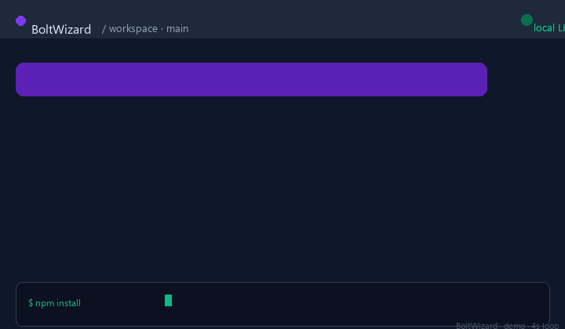
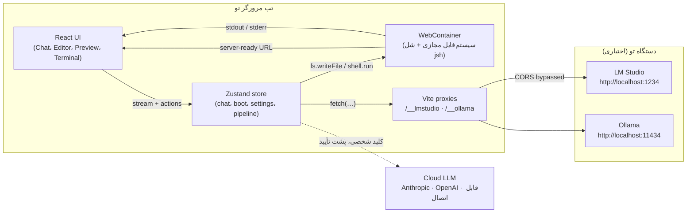
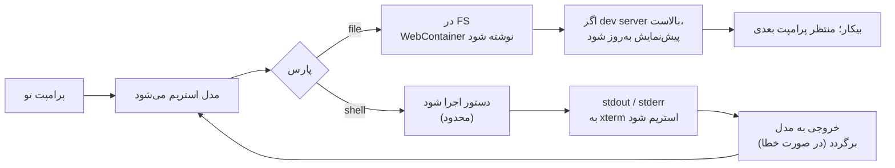
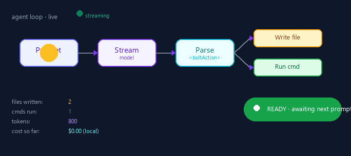
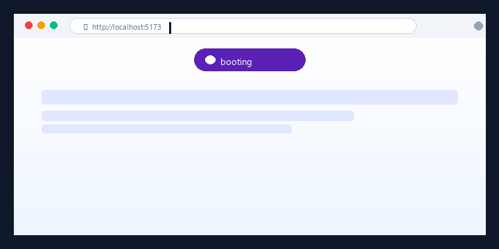

<div dir="rtl">

# 🧙‍♂️⚡ بولت‌ویزارد

<a id="about-the-creator"></a>
<a id="terms-of-service"></a>
<a id="privacy-policy"></a>

> **کلاه جادوگر با صاعقه. ساختن اپ‌های فول‌استک در مرورگر — محلی‌اول، عامل‌محور، قابل‌بررسی.**

<sub>ساخته شده توسط **محمدسعید انگیز (Mohammad Saeed Angiz)** · [دربارهٔ سازنده](#about-the-creator) · [شرایط استفاده](#terms-of-service) · [سیاست‌نامهٔ حریم خصوصی](#privacy-policy)</sub>

<div align="center">

<svg xmlns="http://www.w3.org/2000/svg" viewBox="0 0 220 96" width="440" height="192" role="img" aria-label="BoltWizard — animated hero">
  <defs>
    <radialGradient id="boltGrad" cx="50%" cy="50%" r="50%">
      <stop offset="0%" stop-color="#FCD34D" stop-opacity="1"/>
      <stop offset="70%" stop-color="#FBBF24" stop-opacity="0.9"/>
      <stop offset="100%" stop-color="#F59E0B" stop-opacity="0"/>
    </radialGradient>
    <linearGradient id="hatGrad" x1="0" y1="0" x2="0" y2="1">
      <stop offset="0%" stop-color="#8B5CF6"/>
      <stop offset="100%" stop-color="#5B21B6"/>
    </linearGradient>
    <filter id="glow" x="-50%" y="-50%" width="200%" height="200%">
      <feGaussianBlur stdDeviation="2.5" result="blur"/>
      <feMerge><feMergeNode in="blur"/><feMergeNode in="SourceGraphic"/></feMerge>
    </filter>
  </defs>
  <circle cx="50" cy="48" r="46" fill="url(#hatGrad)" opacity="0.06">
    <animate attributeName="r" values="46;52;46" dur="3.6s" repeatCount="indefinite"/>
    <animate attributeName="opacity" values="0.06;0.12;0.06" dur="3.6s" repeatCount="indefinite"/>
  </circle>
  <path d="M50 8 L88 70 L12 70 Z" fill="url(#hatGrad)" filter="url(#glow)"/>
  <ellipse cx="50" cy="72" rx="42" ry="9" fill="#5B21B6"/>
  <ellipse cx="50" cy="71" rx="40" ry="7" fill="#6D28D9"/>
  <rect x="14" y="64" width="72" height="6" rx="2" fill="#7C3AED"/>
  <g filter="url(#glow)">
    <path d="M56 14 L34 42 L46 42 L40 64 L62 32 L48 32 Z" fill="#FBBF24">
      <animate attributeName="opacity" values="0.85;1;0.85" dur="1.2s" repeatCount="indefinite"/>
    </path>
  </g>
  <circle cx="50" cy="40" r="14" fill="url(#boltGrad)" opacity="0">
    <animate attributeName="r" values="10;26;10" dur="1.4s" repeatCount="indefinite"/>
    <animate attributeName="opacity" values="0.7;0;0.7" dur="1.4s" repeatCount="indefinite"/>
  </circle>
  <text x="104" y="48" font-family="ui-sans-serif, system-ui, -apple-system, Segoe UI, Roboto" font-size="34" font-weight="700" fill="#5B21B6">Bolt</text>
  <text x="166" y="48" font-family="ui-sans-serif, system-ui, -apple-system, Segoe UI, Roboto" font-size="34" font-weight="700" fill="#FBBF24">Wizard</text>
  <text x="104" y="68" font-family="ui-sans-serif, system-ui, -apple-system, Segoe UI, Roboto" font-size="11" fill="#475569">in-browser AI dev agent · local-first · multi-provider LLM</text>
</svg>

</div>

<div align="center">

> **ایده‌ات را در چت بنویس. یک مدل محلی یا ابری فایل‌ها را می‌نویسد، وابستگی‌ها را نصب می‌کند و پیش‌نمایش زنده را اجرا می‌کند — همه در مرورگر تو.**

</div>

<p align="center">
  
</p>
<p align="center"><sub>↑ یک نمونهٔ واقعی از استریم چت · پرامپت → پاسخ دستیار → بلاک‌های <code>&lt;boltAction&gt;</code> → خروجی ترمینال.</sub></p>

---

## فهرست مطالب

- [🪄 بولت‌ویزارد چیست؟](#what-is-boltwizard)
- [🏆 چرا بهترین است](#why-its-the-best)
- [🧱 معماری](#architecture)
- [🔁 حلقهٔ عامل (متحرک)](#the-agent-loop-animated)
- [🛠 چطور استفاده کنید](#how-to-use-it)
- [🔌 ماتریس ارائه‌دهندگان](#provider-matrix)
- [🛡 حریم خصوصی به‌صورت پیش‌فرض](#privacy-by-design)
- [🩺 عیب‌یابی](#troubleshooting)
- [⌨️ فهرست دستورات](#commands-cheat-sheet)
- [🧠 ویژگی‌ها در یک نگاه](#-features-at-a-glance)
- [🧾 دربارهٔ سازنده](#about-the-creator)
- [📜 شرایط استفاده](#terms-of-service)
- [🔒 سیاست‌نامهٔ حریم خصوصی](#privacy-policy)
- [📝 مجوز](#license)

---

<a id="what-is-boltwizard"></a>

## 🪄 بولت‌ویزارد چیست؟

بولت‌ویزارد یک **عامل توسعهٔ هوش مصنوعی درون‌مرورگری** است. آدرس را باز کن، آنچه می‌خواهی بسازی توصیف کن، و ببین چطور عامل یک پروژهٔ واقعی چندفایلی را در یک sandbox شبیه لینوکس که در تب تو اجرا می‌شود، استریم می‌کند. بسته‌های npm را نصب می‌کند، یک dev server راه می‌اندازد و پیش‌نمایش زنده را در یک iframe بارگذاری می‌کند — همه در یک صفحه.

این اپ با **Vite 6 + React 18 + TypeScript + Zustand + Monaco + xterm + `@webcontainer/api`** ساخته شده و رویکرد **محلی‌اول** دارد: با LM Studio یا Ollama روی دستگاه تو، **چیزی از دستگاه خارج نمی‌شود**. با یک مدل ابری، ارائه‌دهنده، payload و هزینه را می‌بینی و قبل از ارسال، آن را تأیید می‌کنی.

---

<a id="why-its-the-best"></a>

## 🏆 چرا بهترین است

هفت برتری که بولت‌ویزارد را از «یک رابط چت روی کد» واقعاً متمایز می‌کند:

### ۱. محلی‌اول به‌صورت پیش‌فرض

بیشتر ابزارهای «کدنویسی با هوش مصنوعی» پرامپت، فایل‌ها و خروجی تو را روی سرور شخص دیگری بارگذاری می‌کنند. حالت پیش‌فرض بولت‌ویزارد، **sandbox را در تب تو** و **مدل را روی دستگاه تو** اجرا می‌کند. کد، پرامپت‌ها و داده‌هایت مالِ تو هستند — تا زمانی که عمداً یک تحویل ابری را تأیید کنی.

### ۲. sandbox واقعی: WebContainers

در زیر کاپوت، بولت‌ویزارد یک **WebContainer** بوت می‌کند — یک runtime شبیه لینوکس که به لطف [WebContainers](https://webcontainers.io) در مرورگر اجرا می‌شود. این runtime، `npm install` را اجرا می‌کند، یک dev server واقعی بالا می‌آورد و URL آن را در اختیار iframe پیش‌نمایش می‌گذارد. با رفرش صفحه یک instance تازه بوت می‌شود؛ فایل‌ها، تنظیمات و تاریخچهٔ چت در `localStorage` ذخیره می‌شوند و از رفرش‌ها جان سالم به‌در می‌برند.

<svg xmlns="http://www.w3.org/2000/svg" viewBox="0 0 600 140" width="600" height="140" role="img" aria-label="مرز WebContainer">
  <defs>
    <linearGradient id="box" x1="0" y1="0" x2="0" y2="1">
      <stop offset="0%" stop-color="#312E81"/>
      <stop offset="100%" stop-color="#1E1B4B"/>
    </linearGradient>
  </defs>
  <rect x="20" y="20" width="560" height="100" rx="14" fill="url(#box)"/>
  <rect x="20" y="20" width="560" height="100" rx="14" fill="none" stroke="#7C3AED" stroke-width="2" stroke-dasharray="6 4">
    <animate attributeName="stroke-dashoffset" values="0;-20" dur="1.5s" repeatCount="indefinite"/>
  </rect>
  <text x="40" y="48" font-family="ui-monospace, SFMono-Regular, Menlo" font-size="11" fill="#A78BFA">/workspace (WebContainer)</text>
  <g font-family="ui-monospace, SFMono-Regular, Menlo" font-size="12" fill="#E0E7FF">
    <text x="40" y="74">src/</text>
    <text x="40" y="92">node_modules/</text>
    <text x="40" y="110">package.json</text>
    <text x="220" y="74">package-lock.json</text>
    <text x="220" y="92">vite.config.ts</text>
    <text x="220" y="110">index.html</text>
  </g>
  <text x="430" y="92" font-family="ui-sans-serif, system-ui" font-size="11" fill="#FCD34D">↳ dev server (server-ready)</text>
</svg>

### ۳. ارائه‌دهندگان مدل قابل تعویض

بولت‌ویزارد هم با **Anthropic** و هم با هر endpoint **OpenAI-compatible** صحبت می‌کند — از جمله سرورهای محلی **LM Studio** و **Ollama**. کلیدها و تنظیمات در `localStorage` تو زندگی می‌کنند، نه روی سرور بولت‌ویزارد.

### ۴. حلقهٔ عامل محدود و قابل‌بررسی

هر پاسخ مدل برای بلاک‌های `<boltAction>` پارس می‌شود:

```
<boltAction type="file" path="src/App.tsx">…محتوای کامل فایل…</boltAction>
<boltAction type="shell">npm install</boltAction>
```

مسیر فایل‌ها در برابر `..`، حروف درایو و کاراکترهای خطرناک شل سخت‌گیری می‌شود (`src/lib/safePath.ts`). دستورات شل با timeout سخت اجرا می‌شوند. خروجی به تو نشان داده می‌شود، به مدل بازگردانده می‌شود و در صورت خطا **یک بار** دوباره تلاش می‌شود — سپس حلقه متوقف می‌شود و منتظر تو می‌ماند. **حلقهٔ بی‌نهایت وجود ندارد. تلاش‌های بی‌صدا وجود ندارد.**

### ۵. خط لولهٔ چندعاملی نظارت‌شده (اختیاری)

کشوی **Supervised pipeline** را باز کن تا از حالت تک‌عامل فراتر بروی. خط لوله چهار مرحله، چهار نقش و دروازه‌های تأیید انسانی در هر گام دارد:

| مرحله | نقش | چه اتفاقی می‌افتد |
|---|---|---|
| **Brainstorm** | `referent` | پرسش و پاسخ مکالمه‌ای برای روشن کردن هدف. |
| **Plan review** | `referent` | گفتگو را به یک **Project Instruction File (PIF)** تبدیل می‌کند. |
| **Build** | `coder` | یک فایل در هر زمان تولید می‌کند: پارس → نوشتن → اجرا → تکرار تا `maxIterations`. |
| **Guardian review** | `guardian` | ممیزی هر فایل + بازبینی جامع نهایی در برابر PIF. |
| **Done** | `supervisor` | هزینه، مصرف توکن و نگرانی‌های باقی‌مانده را نشان می‌دهد. |

می‌توانی **برای هر نقش، ارائه‌دهنده و مدل جداگانه تنظیم کنی** — یک مدل محلی کوچک برای brainstorming و یک مدل ابری قوی فقط برای مرحلهٔ planning.

### ۶. ایزولاسیون Cross-Origin، درست انجام‌شده

`SharedArrayBuffer` پشت `COOP: same-origin` + `COEP: require-corp` قفل شده. بدون این هدرها، WebContainer‌ها از بوت شدن امتناع می‌کنند. تقریباً هر آموزش «کلون bolt.new» بدون این هدرها منتشر می‌شود و در production بی‌صدا می‌شکند. بولت‌ویزارد آن‌ها را در `vite.config.ts` برای dev تنظیم می‌کند و در production نیز از همان هدرها استفاده می‌کند — پیش‌نمایش **ساده کار می‌کند**.

### ۷. برند یک ویژگی است

کلاه جادوگر + صاعقه دکوراسیون نیست. این یک قرارداد است:

- **کلاه** = حفاظ‌های عامل: خط لولهٔ نظارت‌شده، اعتبارسنج مسیر، سقف تکرار.
- **صاعقه** = مدل: هنگام محلی سریع استریم می‌کند، در غیر این صورت با تأیید به سطح بالاتر می‌رود.
- **دو رنگ** (بنفش + زرد الکتریکی)، نوشتهٔ **`Bolt` | `Wizard`** درون‌برنامه‌ای را در یک نگاه قابل تشخیص می‌کنند.

---

<a id="architecture"></a>

## 🧱 معماری

runtime عمداً سبک است. هر نیاز سنگین پشت یک ماژول کوچک و قابل تعویض نشسته است.



لایه‌های پشته:

| لایه | مسئولیت | کد |
|---|---|---|
| **UI shell** | چیدمان، پنل‌ها، تم، صفحات حقوقی با مسیر hash | `src/App.tsx`, `src/components/*` |
| **State** | منبع حقیقت واحد؛ selectorها و actionها | `src/store.ts` |
| **Sandbox** | بوت WebContainer، VFS، شل، استخراج URL dev server | `src/lib/webcontainer.ts` |
| **Agent loop** | استریم → پارس → نوشتن → اجرا → بازخورد → retry محدود | `src/lib/agent.ts` + `tools.ts` |
| **Pipeline** | Brainstorm → PIF → Build → Guardian → Done؛ دروازه‌های تأیید | `src/lib/pipeline/*` |
| **LLM client** | کلاینت استریم یکپارچه برای Anthropic + OpenAI-compatible | `src/lib/llm/client.ts` |
| **Providers** | تنظیمات + کشف (انتخاب خودکار بهترین مدل بارگذاری‌شدهٔ LM Studio) | `src/lib/llm/providers.ts` |

---

<a id="the-agent-loop-animated"></a>

## 🔁 حلقهٔ عامل (متحرک)

مدل ذهنی که باید داشته باشید:



<p align="center">
  
</p>
<p align="center"><sub>↑ یک رندر واقعی از همین حلقه · پرامپت → استریم → پارس → نوشتن/اجرا · با شمارنده‌های زنده.</sub></p>

دو کار این حلقه **هرگز** انجام نمی‌دهد، از ابتدا تا انتها:

- یک دستور را به‌صورت تعاملی اجرا نمی‌کند (بدون `vim`، بدون `less`، بدون REPL منتظر پرامپت). هر فراخوانی شل **با timeout محدود** است.
- از تو نمی‌خواهد برای همیشه صبر کنی. پس از یک retry ناموفق، با خطای قابل‌مشاهده به چت برمی‌گردی.

---

<a id="how-to-use-it"></a>

## 🛠 چطور استفاده کنید

### نصب و اولین بوت

به **Node.js ≥ 20** و **مرورگر Google Chrome** — اکیداً توصیه‌شده (بهترین پشتیبانی از WebContainer، COOP/COEP و SharedArrayBuffer). هر **مرورگر مبتنی بر Chromium** کار می‌کند (Microsoft Edge هم همین‌طور؛ Firefox/Safari پشتیبانی نمی‌شوند).

```bash
npm install
npm run dev          # http://localhost:5173  (باید توسط Vite سرو شود — در ادامه ببینید)
```

URL چاپ‌شده را در Chrome/Edge باز کنید. چند ثانیه بعد، اپ WebContainer را بوت می‌کند و یک status pill روی صفحهٔ boot نشان می‌دهد. اولین بوت ممکن است کمی طول بکشد — رفرش‌های بعدی سریع‌ترند.

> ⚠️ **WebContainer‌ها فقط زمانی بوت می‌شوند که صفحه توسط dev server سرو شود.** `vite.config.ts` هدرهای لازم `COOP: same-origin` و `COEP: require-corp` را تنظیم می‌کند. باز کردن مستقیم `dist/` کار نمی‌کند.

### پیکربندی یک مدل

**Settings** را از نوار بالا (یا <kbd>⌘</kbd>/<kbd>Ctrl</kbd>+<kbd>K</kbd> برای پالت فرمان → «Settings») باز کنید. سپس:

- **Anthropic (Claude)** — کلید API خود را از [console.anthropic.com](https://console.anthropic.com/settings/keys) جای‌گذاری کنید. کلید مستقیماً از تب تو ارسال می‌شود؛ فقط در `localStorage` همین مرورگر زندگی می‌کند.
- **OpenAI (GPT)** — مانند بالا، اما در [platform.openai.com/api-keys](https://platform.openai.com/api-keys).
- **LM Studio (محلی)** — سرور را روی `http://localhost:1234` راه‌اندازی کنید، یک مدل chat-tuned بارگذاری کنید (مثلاً `llama-3.1-8b-instruct`). **Test connection** را بزنید.
- **Ollama (محلی)** — `ollama serve` را اجرا کنید، سپس `ollama pull llama3.1`. اختیاری: `OLLAMA_ORIGINS=*` تا مرورگر بتواند به آن دسترسی پیدا کند.

سرورهای محلی از طریق پروکسی‌های same-origin ویت (`/__lmstudio`، `/__ollama`) قابل دسترسی‌اند — نیازی به فعال‌سازی CORS در هیچ‌جا نیست.

<p align="center">
  
</p>
<p align="center"><sub>↑ پنل پیش‌نمایش در حال بوت شدن · status pill از booting → starting → ready → اپ زنده تغییر می‌کند.</sub></p>

### جریان روزانه

1. **اپ را باز کنید.** منتظر بمانید تا boot overlay ناپدید شود (status pill: <kbd>Ready</kbd>).
2. **یک پرامپت در چت بنویسید** (در سمت چپ). یا روی یکی از سه پرامپت نمونه کلیک کنید.
3. **استریم را تماشا کنید.** هر فایلی که عامل می‌خواهد بنویسد به‌صورت `ActionCard` در چت ظاهر می‌شود. هر دستور اجراشده به ترمینال xterm (در سمت راست) استریم می‌شود.
4. **پیش‌نمایش بالا می‌آید.** به‌محض اینکه dev server بالا بیاید، رویداد `server-ready` بولت‌ویزارد URL آن را منتشر می‌کند — اپ زنده در iframe پیش‌نمایش بارگذاری می‌شود.
5. **با صحبت کردن تکرار کنید.** آخرین پاسخ مدل را با یک پرامپت بعدی ویرایش کنید. عامل قبل از هر تولید، workspace را دوباره می‌خواند.

### ویژگی‌های قدرتمند

- **⚡ اپ شروع‌کننده.** ایده ندارید؟ **Create starter app** را بزنید تا یک قالب Vite + React + TS آماده‌به‌کار در sandbox بارگذاری شود.
- **🧠 خط لولهٔ نظارت‌شده.** از نوار بالا برای حالت چندعاملی: Brainstorm → PIF ساخت‌یافته → تولید/تأیید هر فایل → Guardian review → Done.
- **⌨️ پالت فرمان.** <kbd>⌘</kbd>/<kbd>Ctrl</kbd>+<kbd>K</kbd>: پرش به Settings، تغییر تم، باز کردن Pipeline، پاک کردن چت.
- **📜 تاریخچه به مدل بازمی‌گردد.** تاریخچهٔ چت در نوبت بعدی به مدل ارسال می‌شود تا یادش بماند چه کاری کرده.
- **🌪 iterate / regenerate / modify / approve برای هر فایل.** وقتی Pipeline در حال Build است، هر task در کشوی راست یادداشت operator می‌پذیرد.
- **🌗 تیره / روشن.** تغییر از نوار بالا؛ در `localStorage` ذخیره می‌شود.
- **📦 خروجی.** **Download project (.zip)** در پنل پیش‌نمایش — یک Zip-writer بدون وابستگی، به روش STORE، VFS sandbox را بسته‌بندی می‌کند تا بتوانی آن را با خودت ببری.

### خروجی و بازیابی

WebContainer در حافظه است. رفرش صفحه یک sandbox تازه راه می‌اندازد؛ تاریخچهٔ چت و تنظیمات باقی می‌مانند، اما **نه** فایل‌های پروژه — مگر اینکه export کرده باشی. هر پروژهٔ export نشده را موقتی در نظر بگیر.

---

<a id="provider-matrix"></a>

## 🔌 ماتریس ارائه‌دهندگان

| ارائه‌دهنده | Endpoint | کلید لازم؟ | مدل پیش‌فرض | نکات مختص بولت‌ویزارد |
|---|---|---|---|---|
| **Anthropic** | `https://api.anthropic.com` | بله | `claude-sonnet-4-6` | بهترین برای تولید کد و پلن‌های بلند چندفایلی. |
| **OpenAI** | `https://api.openai.com` | بله | `gpt-4o` | کلاینت‌های OpenAI-compatible هم کار می‌کنند (Base URL قابل تنظیم). |
| **LM Studio** *(محلی)* | proxied via `/__lmstudio` | خیر | اولین مدل chat بارگذاری‌شده | بهترین مدل *instruct بارگذاری‌شده* را خودکار انتخاب می‌کند. |
| **Ollama** *(محلی)* | proxied via `/__ollama` | خیر | `llama3.1` | پروکسی same-origin یعنی نیازی به فعال کردن CORS روی daemon نیست. |

وقتی عامل بخواهد به یک ارائه‌دهندهٔ قوی‌تر **صعود** کند، بولت‌ویزارد به تو نشان می‌دهد:

- کدام ارائه‌دهنده درخواست را دریافت می‌کند؛
- کل payload که ارسال می‌شود؛
- تخمین هزینه؛
- یک دروازهٔ **بله / خیر** قبل از هر ارسال.

بدون صعودهای بی‌صدا.

---

<a id="privacy-by-design"></a>

## 🛡 حریم خصوصی به‌صورت پیش‌فرض

با یک مدل محلی، **چیزی** از دستگاه تو خارج نمی‌شود. اگر یک ارائه‌دهندهٔ ابری فعال کنی، جریان داده عوض می‌شود — اما فقط زمانی که **تو** هر گام را تأیید کنی.

<svg xmlns="http://www.w3.org/2000/svg" viewBox="0 0 720 220" width="720" height="220" role="img" aria-label="جریان داده با مسیر محلی">
  <defs>
    <linearGradient id="local" x1="0" y1="0" x2="1" y2="0">
      <stop offset="0%" stop-color="#16A34A"/>
      <stop offset="100%" stop-color="#10B981"/>
    </linearGradient>
    <linearGradient id="cloud" x1="0" y1="0" x2="1" y2="0">
      <stop offset="0%" stop-color="#94A3B8"/>
      <stop offset="100%" stop-color="#64748B"/>
    </linearGradient>
  </defs>
  <rect x="20" y="20" width="160" height="180" rx="12" fill="#0F172A"/>
  <text x="100" y="50" text-anchor="middle" font-family="ui-sans-serif" font-size="13" fill="#E2E8F0" font-weight="700">تب تو</text>
  <text x="100" y="70" text-anchor="middle" font-family="ui-sans-serif" font-size="11" fill="#A5B4FC">پرامپت‌ها · فایل‌ها · ترمینال</text>
  <text x="100" y="120" text-anchor="middle" font-family="ui-sans-serif" font-size="10" fill="#64748B">WebContainer</text>
  <text x="100" y="135" text-anchor="middle" font-family="ui-sans-serif" font-size="10" fill="#64748B">sandbox</text>
  <text x="100" y="190" text-anchor="middle" font-family="ui-sans-serif" font-size="9" fill="#94A3B8">درون‌مرورگر</text>
  <path d="M 180 80 Q 320 80 380 110" stroke="url(#local)" stroke-width="6" fill="none" stroke-linecap="round" opacity="0.95"/>
  <circle r="6" fill="#16A34A">
    <animateMotion dur="2.4s" repeatCount="indefinite" path="M 180 80 Q 320 80 380 110"/>
  </circle>
  <rect x="380" y="90" width="160" height="40" rx="10" fill="#16A34A"/>
  <text x="460" y="108" text-anchor="middle" font-family="ui-sans-serif" font-size="12" fill="#F0FDF4" font-weight="700">LM Studio</text>
  <text x="460" y="123" text-anchor="middle" font-family="ui-sans-serif" font-size="11" fill="#DCFCE7">روی دستگاه تو</text>
  <text x="460" y="155" text-anchor="middle" font-family="ui-sans-serif" font-size="10" fill="#475569">↳ چیزی خارج نمی‌شود</text>
  <path d="M 180 140 Q 320 140 380 170" stroke="url(#cloud)" stroke-width="3" fill="none" stroke-linecap="round" stroke-dasharray="6 6">
    <animate attributeName="stroke-dashoffset" values="0;-24" dur="2.4s" repeatCount="indefinite"/>
  </path>
  <text x="290" y="135" text-anchor="middle" font-family="ui-sans-serif" font-size="10" fill="#64748B">فقط اگر تأیید کنی</text>
  <rect x="380" y="160" width="160" height="40" rx="10" fill="#E2E8F0" stroke="#94A3B8" stroke-dasharray="4 4"/>
  <text x="460" y="178" text-anchor="middle" font-family="ui-sans-serif" font-size="12" fill="#0F172A" font-weight="700">Anthropic / OpenAI</text>
  <text x="460" y="192" text-anchor="middle" font-family="ui-sans-serif" font-size="10" fill="#64748B">پس از تأیید صریح</text>
</svg>

بولت‌ویزارد **انجام نمی‌دهد**:

- روی کدها یا پرامپت‌هایت آموزش می‌بیند. هرگز.
- آنالیتیکس متصل به نام فایل یا محتوا ارسال نمی‌کند. فقط کوکی/حافظهٔ ضروری.
- روی یک سرور چندمستأجره اجرا نمی‌شود. هیچ backend بولت‌ویزاردی وجود ندارد.

متن کامل را در [🔒 سیاست‌نامهٔ حریم خصوصی](#privacy-policy) ببینید.

---

<a id="troubleshooting"></a>

## 🩺 عیب‌یابی

| نشانه | علت / راه‌حل |
|---|---|
| **پیش‌نمایش خالی یا «Dev server starting…» گیر کرده** | پنل پیش‌نمایش یک لاگ زنده و چک ایزولاسیون نشان می‌دهد. آن را بخوان — معمولاً `npm install` در sandbox شکست خورده. |
| **«Cross-origin isolation is OFF»** | با `npm run dev` اجرا کن (ویت COOP/COEP را تنظیم می‌کند). باز کردن مستقیم فایل‌های build کار نمی‌کند. |
| **LM Studio «کار نمی‌کند» / پاسخ‌های خالی** | بولت‌ویزارد بهترین مدل *instruct بارگذاری‌شده* را خودکار انتخاب می‌کند. مطمئن شو یک مدل chat-tuned (مثلاً `llama-3.1-8b-instruct`) بارگذاری شده. |
| **خروجی وسط کد قطع می‌شود** | از یک مدل instruct (غیر reasoning) استفاده کن. **Max tokens** در LM Studio را به ۱۶۳۸۴+ افزایش بده. |
| **پیش‌نمایش خود editor را نشان می‌دهد** | قبلاً برطرف شده — پیش‌نمایش از URL `server-ready` WebContainer استفاده می‌کند. |
| **بوت شکست خورد / «retry did not recover»** | WebContainer یک‌بار در هر بار بارگذاری صفحه بالا می‌آید؛ **صفحه را رفرش کن**. بلاکرهای محتوا هم می‌توانند مانع شوند. |
| **مدل می‌خواهد خارج از پروژه بنویسد** | اعتبارسنج مسیر (`src/lib/safePath.ts`) فرارهای `..`، حروف درایو و نام‌های رزرو شدهٔ ویندوز را رد می‌کند. |

---

<a id="commands-cheat-sheet"></a>

## ⌨️ فهرست دستورات

```bash
# توسعهٔ روزانه
npm run dev               # Vite + هدرهای cross-origin (تنها bootstrap پشتیبانی‌شده)
npm run build             # tsc -b && vite build  → dist/
npm run preview           # پیش‌نمایش بیلد (هنوز به هدرهای dev نیاز دارد)
npm run lint              # پاکسازی ESLint flat-config (dist/, node_modules/, coverage/ نادیده گرفته می‌شوند)

# تست‌ها
npm test                  # تست smoke بومی Node (tests/smoke.mjs)
npm run watch             # watcher خودکار فایل — lint + test در هر ذخیره

# تشخیص و Pipeline (ابزارهای توسعه با Playwright)
npm run diagnose:layout
npm run render:pipeline
npm run live:run
```

درون اپ:

| میانبر | عمل |
|---|---|
| <kbd>⌘</kbd>+<kbd>K</kbd> / <kbd>Ctrl</kbd>+<kbd>K</kbd> | باز کردن پالت فرمان |
| <kbd>Esc</kbd> | بستن هر پنل باز |
| <kbd>Enter</kbd> | ارسال پیام چت |
| <kbd>Shift</kbd>+<kbd>Enter</kbd> | خط جدید در پیام چت |

---

<a id="features-at-a-glance"></a>

## 🧠 ویژگی‌ها در یک نگاه

| حوزه | آنچه بولت‌ویزارد به تو می‌دهد |
|---|---|
| **سطح Build** | Chat → پروژهٔ چندفایلی استریم؛ ویرایشگر Monaco با تب؛ iframe پیش‌نمایش زنده؛ شل xterm روی sandbox واقعی Node.js |
| **عملیات فایل** | پوشه‌ها + فایل‌ها (جدید / تغییر نام / حذف / رفرش)، انتخاب درخت، خروجی به `.zip` |
| **عامل‌ها** | عامل چت تک‌نوبتی؛ Pipeline چندعاملی نظارت‌شده اختیاری با نقش‌های referent / coder / guardian / supervisor |
| **مدل‌ها** | Anthropic، OpenAI، Ollama، LM Studio. پروکسی‌های same-origin ویت (`/__lmstudio`، `/__ollama`) سرورهای محلی را بدون CORS نگه می‌دارند. کلید شخصی در `localStorage` |
| **حریم خصوصی** | محلی‌اول به‌صورت پیش‌فرض؛ تأیید صریح + پیش‌نمایش payload قبل از صعود ابری؛ بدون آموزش؛ بدون آنالیتیکس روی فایل یا پرامپت |
| **UX** | پالت فرمان <kbd>⌘</kbd>+<kbd>K</kbd> · تم روشن/تیره · میانبرهای `<kbd>`-aware · اعلان‌های toast · استریم با caret |
| **اعتماد** | اعتبارسنج مسیر فرارهای `..`، حروف درایو و نام‌های رزرو ویندوز را رد می‌کند؛ retry محدود؛ timeout شل محدود؛ لاگ‌های شفاف |

---

<a id="about-the-creator"></a>

## 🧾 دربارهٔ سازنده

<sub>از فوتر اپ و صفحهٔ About درون‌برنامه (`#/about`) لینک شده.</sub>

**بولت‌ویزارد توسط [محمدسعید انگیز](https://github.com/saeedangiz1)** ساخته شده — یک محصول تک‌نفره/مستقل. قاب «کلاه و صاعقه» عمدی است: بیشتر ابزارهای کدنویسی مرورگری حس اسباب‌بازی می‌دهند. بولت‌ویزارد تلاشی است برای گرفتن بهترین بخش‌های توسعهٔ فوری، محلی و قابل اشتراک‌گذاری با یک URL و پیوند زدن آن‌ها به توانایی شگفت‌انگیز مدل‌های زبانی بزرگ — بدون اینکه کارت به‌طور پیش‌فرض از دستگاهت خارج شود.

اگر پیشنهادی داری یا باگی پیدا کردی، لطفاً در [مخزن پروژه](https://github.com/saeedangiz1/BoltWizard) یک Issue باز کن.

---

<a id="terms-of-service"></a>

## 📜 شرایط استفاده

<sub>از فوتر درون‌برنامه (`#/terms`) لینک شده و در بالا به‌عنوان لطف نشان داده شده. مسیر درون‌برنامه برای کاربران مرجع است.</sub>

- **چیست.** یک عامل توسعهٔ هوش مصنوعی درون‌مرورگری که یک sandbox در تب تو اجرا می‌کند و در صورت تأیید تو به یک مدل ابری **فقط** صعود می‌کند.
- **شرایط سنی.** ۱۳+.
- **استفادهٔ مجاز.** بدون بدافزار، بدون کیت‌های فیشینگ، بدون scraping/فروش مجدد سرویس، بدون نقض حقوق شخص ثالث.
- **محتوا و IP شما.** تو مالک هر چیزی هستی که در بولت‌ویزارد می‌سازی. ما ادعایی بر پروژه‌ات نداریم.
- **خروجی هوش مصنوعی.** کد تولیدشده **بدون ضمانت** صحت، امنیت یا تناسب ارائه می‌شود. قبل از اجرا/استقرار باید بررسی‌اش کنی.
- **ارائه‌دهندگان LLM ابری.** هنگام تأیید صعود، داده‌هایت **تحت شرایط آن‌ها** به آن ارائه‌دهنده می‌رود. ما گیرنده + payload + هزینه را قبل از ارسال نشان می‌دهیم.
- **مدل‌های محلی.** هنگام استفاده از LM Studio یا Ollama، مدل روی دستگاه تو اجرا می‌شود. خارج از کنترل ما، در مسئولیت تو.
- **بدون ضمانت.** as-is ارائه می‌شود؛ بدون مسئولیت برای خسارات غیرمستقیم؛ سقف مسئولیت معادل مبالغ پرداختی (در صورت وجود) در دوازده ماه گذشته.
- **غرامت.** تو بولت‌ویزارد را از ادعاها، خسارات و هزینه‌های (شامل هزینه‌های معقول وکیل) ناشی از استفادهٔ تو، محتوای تولیدشده یا نقض این شرایط یا حقوق شخص ثالث مبرا می‌کنی.
- **طرح‌های پولی** (در صورت معرفی): پیش‌پرداخت؛ شرایط بازپرداخت/تعلیق/لغو در نقطهٔ خرید.
- **تغییرات.** تاریخ «آخرین به‌روزرسانی» تغییرات را نشان می‌دهد. ادامهٔ استفاده به منزلهٔ پذیرش است.
- **لغو.** هر زمان صفحه را ببند. ما ممکن است خدمات اختیاری را به‌خاطر تخلف یا دلایل عملیاتی تعلیق کنیم.
- **قانون حاکم و اختلافات.** تابع قوانین حوزهٔ قضایی محلی تو؛ اختلافات در دادگاه‌های محلی حل می‌شود.
- **تماس.** `hello@boltwizard.app`

---

<a id="privacy-policy"></a>

## 🔒 سیاست‌نامهٔ حریم خصوصی

<sub>از فوتر درون‌برنامه (`#/privacy`) لینک شده و در بالا به‌عنوان لطف نشان داده شده. مسیر درون‌برنامه برای کاربران مرجع است.</sub>

- **محلی‌اول تیتر اصلی است.** با مدل‌های محلی، **چیزی از دستگاه تو خارج نمی‌شود** — هیچ بخشی از بولت‌ویزارد هرگز پرامپت‌ها یا کدت را نمی‌بیند.
- **WebContainer در تب تو اجرا می‌شود.** هیچ آپلودی به ما نیست. sandbox وقتی صفحه را می‌بندی ناپدید می‌شود.
- **چه چیزی جمع می‌کنیم.** حداقل: ارائه‌دهنده، مدل، تم و پیکربندی نقش در `localStorage`. هیچ آنالیتیکس روی نام فایل، محتوای فایل، پرامپت یا خروجی تولیدشده.
- **بدون حساب کاربری الزامی.** اگر حساب‌ها اضافه شوند، فقط ایمیل — هرگز برای بازاریابی.
- **صعود ابری opt-in.** فقط با تأیید تو: payload، گیرنده و تخمین قبل از ارسال نشان داده می‌شود.
- **حافظهٔ محلی.** تنظیمات + state در `localStorage` و WebContainer درون‌حافظه‌ای؛ قابل پاک شدن از UI یا تنظیمات مرورگر. پاک کردن دائمی است چون ما اصلاً داده را دریافت نکرده‌ایم.
- **کوکی‌ها.** فقط ضروری. بدون ردگیری تبلیغاتی.
- **شخص ثالث.** LM Studio / Ollama (محلی) — هیچ داده‌ای خارج نمی‌شود. ارائه‌دهندگان ابری به انتخاب تو — فقط آنچه تأیید می‌کنی دریافت می‌کنند، تحت سیاست آن‌ها.
- **امنیت.** TLS در حین انتقال؛ ایزولاسیون WebContainer درون‌تب از طریق COOP/COEP؛ اصل حداقل‌امتیاز.
- **کودکان.** برای کودکان زیر ۱۳ سال در نظر گرفته نشده.
- **انتقالات بین‌المللی.** فقط در صورت انتخاب ارائه‌دهندهٔ ابری مرتبط است؛ حالت محلی هرگز انتقال نمی‌دهد.
- **حقوق شما.** بیشتر خودخدمت: اپ را برای **دسترسی** باز کن، **حذف** با پاک کردن داده‌های سایت، **صادر** با کپی فایل‌ها از ویرایشگر.
- **تغییرات.** تاریخ به‌روزرسانی؛ تغییرات مهم درون‌اپ اعلام می‌شوند.
- **تماس.** `hello@boltwizard.app`

---

<a id="license"></a>

## 📝 مجوز

پروژهٔ خصوصی. برای استفادهٔ تک‌کاربرهٔ محلی ساخته شده. برای متن مرجع به مسیرهای **شرایط** و **حریم خصوصی** درون‌اپ (`#/terms`، `#/privacy`) مراجعه کنید؛ خلاصه‌های Markdown در بالا صرفاً جنبهٔ اطلاع‌رسانی دارند.

<sub>با مراقبت ساخته شده توسط [محمدسعید انگیز](https://github.com/saeedangiz1).</sub>

</div>
