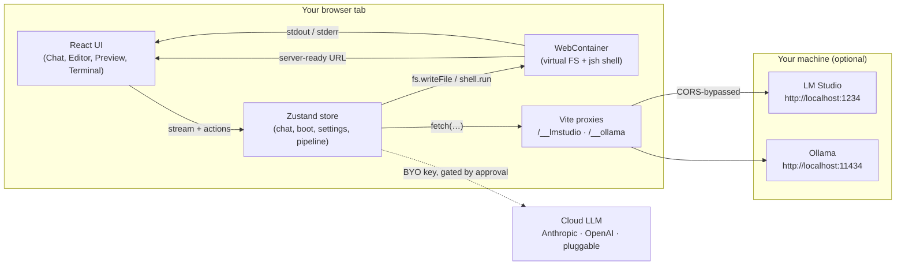
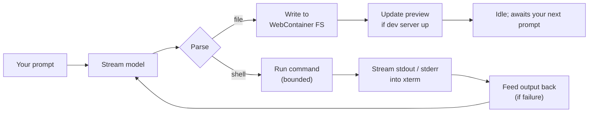

# 🧙‍♂️⚡ BoltWizard

<a id="about-the-creator"></a>
<a id="terms-of-service"></a>
<a id="privacy-policy"></a>

> **A wizard's hat carrying a lightning bolt. Build full-stack apps in your browser — local-first, agentic, inspectable.**

<sub>Created by **Mohammad Saeed Angiz** · [About](#about-the-creator) · [Terms](#terms-of-service) · [Privacy](#privacy-policy)</sub>

---

<!-- ================================================================ HERO == -->

<div align="center">

<!-- Animated hero: a wizard's hat (cone + brim) with a lightning bolt that pulses electric, copied from /public/logo.svg with SMIL animation overlaid. -->

<svg xmlns="http://www.w3.org/2000/svg" viewBox="0 0 220 96" width="440" height="192" role="img" aria-label="BoltWizard — animated hero">
  <defs>
    <radialGradient id="boltGrad" cx="50%" cy="50%" r="50%">
      <stop offset="0%" stop-color="#FCD34D" stop-opacity="1"/>
      <stop offset="70%" stop-color="#FBBF24" stop-opacity="0.9"/>
      <stop offset="100%" stop-color="#F59E0B" stop-opacity="0"/>
    </radialGradient>
    <linearGradient id="hatGrad" x1="0" y1="0" x2="0" y2="1">
      <stop offset="0%" stop-color="#8B5CF6"/>
      <stop offset="100%" stop-color="#5B21B6"/>
    </linearGradient>
    <filter id="glow" x="-50%" y="-50%" width="200%" height="200%">
      <feGaussianBlur stdDeviation="2.5" result="blur"/>
      <feMerge>
        <feMergeNode in="blur"/>
        <feMergeNode in="SourceGraphic"/>
      </feMerge>
    </filter>
  </defs>

  <!-- Subtle background ripple. -->
  <circle cx="50" cy="48" r="46" fill="url(#hatGrad)" opacity="0.06">
    <animate attributeName="r" values="46;52;46" dur="3.6s" repeatCount="indefinite"/>
    <animate attributeName="opacity" values="0.06;0.12;0.06" dur="3.6s" repeatCount="indefinite"/>
  </circle>

  <!-- Conical hat -->
  <path d="M50 8 L88 70 L12 70 Z" fill="url(#hatGrad)" filter="url(#glow)"/>
  <!-- Hat brim (two layers for depth) -->
  <ellipse cx="50" cy="72" rx="42" ry="9" fill="#5B21B6"/>
  <ellipse cx="50" cy="71" rx="40" ry="7" fill="#6D28D9"/>
  <!-- Hat band -->
  <rect x="14" y="64" width="72" height="6" rx="2" fill="#7C3AED"/>

  <!-- Lightning-bolt sigil -->
  <g filter="url(#glow)">
    <path d="M56 14 L34 42 L46 42 L40 64 L62 32 L48 32 Z" fill="#FBBF24">
      <animate attributeName="opacity" values="0.85;1;0.85" dur="1.2s" repeatCount="indefinite"/>
    </path>
  </g>

  <!-- Electric pulse around the bolt -->
  <circle cx="50" cy="40" r="14" fill="url(#boltGrad)" opacity="0">
    <animate attributeName="r" values="10;26;10" dur="1.4s" repeatCount="indefinite"/>
    <animate attributeName="opacity" values="0.7;0;0.7" dur="1.4s" repeatCount="indefinite"/>
  </circle>

  <!-- Wordmark — same colour split as the in-app TopBar. -->
  <text x="104" y="48" font-family="ui-sans-serif, system-ui, -apple-system, Segoe UI, Roboto" font-size="34" font-weight="700" fill="#5B21B6">Bolt</text>
  <text x="166" y="48" font-family="ui-sans-serif, system-ui, -apple-system, Segoe UI, Roboto" font-size="34" font-weight="700" fill="#FBBF24">Wizard</text>
  <text x="104" y="68" font-family="ui-sans-serif, system-ui, -apple-system, Segoe UI, Roboto" font-size="11" fill="#475569">in-browser AI dev agent · local-first · multi-provider LLM</text>
</svg>

</div>

<div align="center">

> **Describe an app in chat. A local or cloud LLM writes the files, installs dependencies, and runs a live preview — entirely in your browser.**

</div>

<p align="center">
  <a href="#install--first-boot"><b>Install</b></a> ·
  <a href="#how-to-use-it"><b>How to use</b></a> ·
  <a href="#architecture"><b>Architecture</b></a> ·
  <a href="#the-agent-loop-animated"><b>Agent loop</b></a> ·
  <a href="#provider-matrix"><b>Providers</b></a> ·
  <a href="#privacy-by-design"><b>Privacy</b></a> ·
  <a href="#troubleshooting"><b>Troubleshooting</b></a>
</p>

---

## Table of contents

- [🪄 What is BoltWizard?](#what-is-boltwizard)
- [🏆 Why it's the best](#why-its-the-best)
  - [1. Local-first by default](#1-local-first-by-default)
  - [2. Real sandbox: WebContainers](#2-real-sandbox-webcontainers)
  - [3. Pluggable LLM providers](#3-pluggable-llm-providers)
  - [4. Bounded, inspectable agent loop](#4-bounded-inspectable-agent-loop)
  - [5. Supervised multi-agent pipeline (optional)](#5-supervised-multi-agent-pipeline-optional)
  - [6. Cross-origin isolation, done right](#6-cross-origin-isolation-done-right)
  - [7. The brand is a feature](#7-the-brand-is-a-feature)
  - [8. Open and inspectable](#8-open-and-inspectable)
- [🧱 Architecture](#architecture)
- [🔁 The agent loop (animated)](#the-agent-loop-animated)
- [🛠 How to use it](#how-to-use-it)
  - [Install & first boot](#install--first-boot)
  - [Configure an LLM](#configure-an-llm)
  - [The daily flow](#the-daily-flow)
  - [Power features](#power-features)
  - [Export & recovery](#export--recovery)
- [🔌 Provider matrix](#provider-matrix)
- [🛡 Privacy by design](#privacy-by-design)
- [🩺 Troubleshooting](#troubleshooting)
- [⌨️ Commands cheat sheet](#commands-cheat-sheet)
- [🧠 Features at a glance](#-features-at-a-glance)
- [🧾 About the creator](#about-the-creator)
- [📜 Terms of Service](#terms-of-service)
- [🔒 Privacy Policy](#privacy-policy)
- [📝 License](#license)

---

<a id="what-is-boltwizard"></a>

## 🪄 What is BoltWizard?

BoltWizard is an **in-browser AI dev agent**. Open the URL, type what you want to build, and watch the agent stream a real, multi-file project into a Linux-shaped sandbox running inside your tab. It installs npm packages, starts a dev server, and loads the live preview in an iframe — all from one page.

The app is built with **Vite 6 + React 18 + TypeScript + Zustand + Monaco + xterm + `@webcontainer/api`**, and ships a **local-first** stance: with LM Studio or Ollama on your machine, **nothing leaves your device**. With a cloud model, you see the provider, the payload, and the cost, and you approve the request before it goes out.

---

<a id="why-its-the-best"></a>

## 🏆 Why it's the best

The eight wins that make BoltWizard genuinely different from a "chat UI on top of code":

### 1. Local-first by default

Most "AI coding" tools upload your prompt, your files, and your output to someone else's server. BoltWizard's default mode runs the **sandbox in your tab** and the **LLM on your machine**. Your code, your prompts, your data — until you intentionally approve a cloud hand-off.

### 2. Real sandbox: WebContainers

Under the hood, BoltWizard boots a **WebContainer** — a Linux-shaped, in-browser runtime powered by [WebContainers](https://webcontainers.io). It runs `npm install`, spins up a real dev server, and exposes the URL to the preview iframe. Refreshing the page boots a fresh one; the editor's files, settings, and chat history live in `localStorage` so they survive reloads.

<!-- Tiny diagram: the sandbox boundary -->
<svg xmlns="http://www.w3.org/2000/svg" viewBox="0 0 600 140" width="600" height="140" role="img" aria-label="WebContainer sandbox boundary">
  <defs>
    <linearGradient id="box" x1="0" y1="0" x2="0" y2="1">
      <stop offset="0%" stop-color="#312E81"/>
      <stop offset="100%" stop-color="#1E1B4B"/>
    </linearGradient>
  </defs>
  <rect x="20" y="20" width="560" height="100" rx="14" fill="url(#box)"/>
  <rect x="20" y="20" width="560" height="100" rx="14" fill="none" stroke="#7C3AED" stroke-width="2" stroke-dasharray="6 4">
    <animate attributeName="stroke-dashoffset" values="0;-20" dur="1.5s" repeatCount="indefinite"/>
  </rect>
  <text x="40" y="48" font-family="ui-monospace, SFMono-Regular, Menlo" font-size="11" fill="#A78BFA">/workspace (WebContainer)</text>
  <g font-family="ui-monospace, SFMono-Regular, Menlo" font-size="12" fill="#E0E7FF">
    <text x="40" y="74">src/</text>
    <text x="40" y="92">node_modules/</text>
    <text x="40" y="110">package.json</text>
    <text x="220" y="74">package-lock.json</text>
    <text x="220" y="92">vite.config.ts</text>
    <text x="220" y="110">index.html</text>
  </g>
  <text x="430" y="92" font-family="ui-sans-serif, system-ui" font-size="11" fill="#FCD34D">↳ dev server (server-ready)</text>
</svg>

### 3. Pluggable LLM providers

BoltWizard speaks both **Anthropic** and any **OpenAI-compatible** endpoint — including **local** LM Studio and Ollama servers. Keys and provider settings live in your `localStorage`, never on a BoltWizard server.

### 4. Bounded, inspectable agent loop

Every model reply is parsed for `<boltAction>` blocks:

```
<boltAction type="file" path="src/App.tsx">…full file contents…</boltAction>
<boltAction type="shell">npm install</boltAction>
```

Files are path-hardened against `..`, drive letters, and shell-dangerous characters (`src/lib/safePath.ts`). Shell commands run with a hard timeout. The output is shown to you, fed back to the model, and re-tried once on failure — then the loop stops and waits for you. **No infinite loops. No silent retries.**

### 5. Supervised multi-agent pipeline (optional)

Open the **Supervised pipeline** drawer to step outside the single-agent chat. The pipeline has four phases, four roles, and human approval gates at every step:

| Phase | Role | What happens |
|---|---|---|
| **Brainstorm** | `referent` | Conversational clarifying Q&A on the goal. |
| **Plan review** | `referent` | Turns the conversation into a **Project Instruction File (PIF)**. |
| **Build** | `coder` | Generates one file at a time, parses → writes → runs → iterates up to `maxIterations`. |
| **Guardian review** | `guardian` | Per-file audits + a final holistic review against the PIF. |
| **Done** | `supervisor` | Surfaces cost, token use, and any remaining concerns. |

You can configure **per-role providers and models** — run a tiny local model for brainstorming and a strong cloud model only for the planning step.

### 6. Cross-origin isolation, done right

`SharedArrayBuffer` is gated behind `COOP: same-origin` + `COEP: require-corp`. Without them, WebContainers refuse to boot. Almost every "bolt.new clone" tutorial ships without these and silently breaks in production. BoltWizard sets them in `vite.config.ts` for dev and uses the same headers in production — so the preview **just works**.

### 7. The brand is a feature

The wizard hat + lightning bolt isn't decoration. It's a contract:

- **The hat** = the agent's guardrails: the supervised pipeline, the path validator, the iteration caps.
- **The bolt** = the model: stream-fast when local, escalate-on-approval when not.
- **The two colours** (violet + electric yellow) make the in-app wordmark **`Bolt` | `Wizard`** recognisable at a glance.

### 8. Open and inspectable

- Every file write is a visible **ActionCard** in the chat panel.
- The xterm terminal mirrors the in-container shell live.
- The Pipeline drawer shows what each agent received, decided, and wrote.
- Everything is open source to read.

---

<a id="architecture"></a>

## 🧱 Architecture

The runtime is intentionally thin. Every heavyweight concern sits behind a small, swappable module.

<!-- Mermaid renders natively on GitHub. -->


The stack up close:

| Layer | Responsibility | Code |
|---|---|---|
| **UI shell** | Layout, panels, theming, hash-routed legal pages | `src/App.tsx`, `src/components/*` |
| **State** | Single source of truth; selectors + actions | `src/store.ts` |
| **Sandbox** | WebContainer boot, VFS, shell, dev-server URL extraction | `src/lib/webcontainer.ts` |
| **Agent loop** | Stream → parse → write → run → re-feed → capped retry | `src/lib/agent.ts` + `tools.ts` |
| **Pipeline** | Brainstorm → PIF → Build → Guardian → Done; approval gates | `src/lib/pipeline/*` |
| **LLM client** | Unified streaming client for Anthropic + OpenAI-compat | `src/lib/llm/client.ts` |
| **Providers** | Settings + discovery (auto-pick best loaded LM Studio model) | `src/lib/llm/providers.ts` |

---

<a id="the-agent-loop-animated"></a>

## 🔁 The agent loop (animated)

The mental model you should hold:



What's actually animated in the app, in SVG (the same kind of marker you'll see in the UI when the agent is mid-stream):

<!-- SMIL-animated agent-loop SVG. Renders on GitHub. -->
<svg xmlns="http://www.w3.org/2000/svg" viewBox="0 0 720 100" width="720" height="100" role="img" aria-label="Agent loop animation">
  <defs>
    <marker id="arr" viewBox="0 0 10 10" refX="9" refY="5" markerWidth="6" markerHeight="6" orient="auto-start-reverse">
      <path d="M 0 0 L 10 5 L 0 10 z" fill="#94A3B8"/>
    </marker>
  </defs>

  <!-- Boxes -->
  <g font-family="ui-sans-serif, system-ui, -apple-system, Segoe UI, Roboto" font-size="12">
    <rect x="10"  y="30" width="120" height="40" rx="10" fill="#EEF2FF" stroke="#6366F1"/>
    <text x="70"  y="55" text-anchor="middle" fill="#3730A3" font-weight="600">Prompt</text>

    <rect x="160" y="30" width="120" height="40" rx="10" fill="#F5F3FF" stroke="#7C3AED"/>
    <text x="220" y="55" text-anchor="middle" fill="#5B21B6" font-weight="600">Stream</text>

    <rect x="310" y="30" width="120" height="40" rx="10" fill="#ECFEFF" stroke="#06B6D4"/>
    <text x="370" y="55" text-anchor="middle" fill="#0E7490" font-weight="600">Parse</text>

    <rect x="460" y="14" width="130" height="22" rx="6" fill="#FEF3C7" stroke="#F59E0B"/>
    <text x="525" y="29" text-anchor="middle" fill="#92400E" font-weight="600">Write file</text>

    <rect x="460" y="62" width="130" height="22" rx="6" fill="#DCFCE7" stroke="#16A34A"/>
    <text x="525" y="77" text-anchor="middle" fill="#166534" font-weight="600">Run command</text>

    <circle cx="650" cy="50" r="22" fill="#F1F5F9" stroke="#0F172A"/>
    <!-- Animated stop sign "idle" — pulses to indicate waiting for you. -->
    <circle cx="650" cy="50" r="6" fill="#0F172A">
      <animate attributeName="r" values="5;8;5" dur="1.6s" repeatCount="indefinite"/>
      <animate attributeName="opacity" values="1;0.4;1" dur="1.6s" repeatCount="indefinite"/>
    </circle>
    <text x="650" y="92" text-anchor="middle" fill="#475569">idle</text>
  </g>

  <!-- Static arrows -->
  <line x1="130" y1="50" x2="160" y2="50" stroke="#94A3B8" marker-end="url(#arr)"/>
  <line x1="280" y1="50" x2="310" y2="50" stroke="#94A3B8" marker-end="url(#arr)"/>

  <!-- Animated dashed arrows from Parse → Write and Parse → Run -->
  <line x1="430" y1="50" x2="460" y2="25" stroke="#94A3B8" stroke-dasharray="4 3" marker-end="url(#arr)">
    <animate attributeName="stroke-dashoffset" values="0;-14" dur="0.8s" repeatCount="indefinite"/>
  </line>
  <line x1="430" y1="50" x2="460" y2="73" stroke="#94A3B8" stroke-dasharray="4 3" marker-end="url(#arr)">
    <animate attributeName="stroke-dashoffset" values="0;-14" dur="0.8s" repeatCount="indefinite"/>
  </line>

  <!-- "feed back" curved animated path: reveals the bounded retry. -->
  <path d="M 590 80 Q 615 88 630 70" stroke="#EF4444" stroke-dasharray="3 3" fill="none" marker-end="url(#arr)">
    <animate attributeName="stroke-dashoffset" values="0;-12" dur="1s" repeatCount="indefinite"/>
  </path>
  <text x="600" y="98" font-family="ui-sans-serif, system-ui" font-size="10" fill="#B91C1C">retry ×1 (bounded)</text>
</svg>

Two things this loop **never** does, by construction:

- Runs a command interactively (no `vim`, no `less`, no prompt-waiting REPLs). Every shell call is **bounded by a timeout**.
- Asks you to wait forever. After one failed retry, the loop drops you back into the chat with the error visible.

---

<a id="how-to-use-it"></a>

## 🛠 How to use it

### Install & first boot

You'll need **Node.js ≥ 20** and a **Chromium-based browser** (Chrome or Edge) for the in-browser sandbox.

```bash
npm install
npm run dev          # http://localhost:5173  (must be served by Vite — see below)
```

Open the printed URL in Chrome/Edge. A few seconds later the app boots the WebContainer and shows a status pill across the boot overlay. The first boot can take a moment — subsequent reloads are faster.

> ⚠️ **WebContainers only boot when the page is served over the dev server.** `vite.config.ts` sets the required `COOP: same-origin` + `COEP: require-corp` headers. Opening `dist/` directly will not work.

### Configure an LLM

Open **Settings** from the top bar (or <kbd>⌘</kbd>/<kbd>Ctrl</kbd>+<kbd>K</kbd> for the command palette → "Settings"). Then:

- **Anthropic (Claude)** — paste your API key from [console.anthropic.com](https://console.anthropic.com/settings/keys). The key is sent directly from your tab; it lives only in this browser's `localStorage`.
- **OpenAI (GPT)** — same, but at [platform.openai.com/api-keys](https://platform.openai.com/api-keys).
- **LM Studio (local)** — start the server on `http://localhost:1234`, load a chat-tuned model (e.g. `llama-3.1-8b-instruct`). Just hit **Test connection**.
- **Ollama (local)** — run `ollama serve`, then `ollama pull llama3.1`. Optional: `OLLAMA_ORIGINS=*` so the browser can reach it.

The local servers are reached through same-origin Vite proxies (`/__lmstudio`, `/__ollama`) so you don't need to enable CORS anywhere.

> 💡 **Tip for LM Studio users:** set **Max tokens** high (16384+). A low cap there will silently truncate the model's reply mid-file.

### The daily flow

1. **Open the app.** Wait for the boot overlay to disappear (status pill: <kbd>Ready</kbd>).
2. **Type a prompt** in the chat on the left. Or click one of the three example prompts.
3. **Watch it stream.** Each file the agent wants to write appears as an `ActionCard` in the chat. Each command it runs streams into the xterm terminal on the right.
4. **Preview pans over.** Once the dev server is up, BoltWizard's `server-ready` event surfaces its URL — the live app loads in the preview iframe.
5. **Iterate by talking.** Edit the model's last reply with a follow-up. The agent re-reads the workspace before each generation.

### Power features

- **⚡ Starter app.** Don't have an idea? Click **Create starter app** for an instant runnable Vite + React + TS template loaded into the sandbox.
- **🧠 Supervised pipeline.** Open from the top bar for multi-agent mode: brainstorm → structured PIF → per-file generate / verify → guardian review → done. Configure per-role providers/models in the pipeline drawer.
- **⌨️ Command palette.** <kbd>⌘</kbd>/<kbd>Ctrl</kbd>+<kbd>K</kbd>: jump to Settings, toggle theme, open the pipeline, clear chat.
- **📜 History flows back into the model.** The chat transcript is sent back at the next turn so the agent remembers what it did.
- **🪪 Per-file iterate / regenerate / modify / approve.** When the pipeline is mid-build, every task in the right drawer accepts operator notes for one-shot fixes without re-running the whole plan.
- **🌗 Dark / light.** Toggle from the top bar; persisted to `localStorage`.
- **📦 Export.** Click **Download project (.zip)** in the preview panel — a dependency-free STORE-method zip writer packages the sandbox VFS so you can take it elsewhere.

### Export & recovery

The WebContainer is in-memory. Reloading the page starts a fresh sandbox; your chat history and settings persist, but **not** your project files unless you've exported them. Treat any unexported project as transient.

---

<a id="provider-matrix"></a>

## 🔌 Provider matrix

| Provider | Endpoint | Needs key | Default model | Boltwizard-specific notes |
|---|---|---|---|---|
| **Anthropic** | `https://api.anthropic.com` | yes | `claude-sonnet-4-6` | Best for code generation and long, multi-file plans. |
| **OpenAI** | `https://api.openai.com` | yes | `gpt-4o` | OpenAI-compat clients also work (configurable base URL). |
| **LM Studio** *(local)* | proxied via `/__lmstudio` | no | first loaded chat model | Auto-picks the best *loaded instruct* model — filters out tiny / reasoning-only / embedding / vision models. Catches `reasoning_content` so quiet reasoning models aren't silent. |
| **Ollama** *(local)* | proxied via `/__ollama` | no | `llama3.1` | Same-origin proxy means you don't need to flip CORS on the daemon. |

When the agent wants to **escalate** to a stronger provider, BoltWizard shows you:

- which provider will receive the request;
- the full payload that will be sent;
- an estimate of cost;
- a **yes / no** gate before anything goes out.

No silent climbs.

---

<a id="privacy-by-design"></a>

## 🛡 Privacy by design

Run a local LLM and **nothing** leaves your device. Switch on a cloud provider and the data flow shifts — but only when **you** approve each step.

<!-- Animated data-flow SVG: shows local path "green" glowing, cloud path "dim" until activated -->
<svg xmlns="http://www.w3.org/2000/svg" viewBox="0 0 720 220" width="720" height="220" role="img" aria-label="Data flow with local-first path">
  <defs>
    <linearGradient id="local" x1="0" y1="0" x2="1" y2="0">
      <stop offset="0%" stop-color="#16A34A"/>
      <stop offset="100%" stop-color="#10B981"/>
    </linearGradient>
    <linearGradient id="cloud" x1="0" y1="0" x2="1" y2="0">
      <stop offset="0%" stop-color="#94A3B8"/>
      <stop offset="100%" stop-color="#64748B"/>
    </linearGradient>
  </defs>

  <!-- Source: Your tab -->
  <rect x="20" y="20" width="160" height="180" rx="12" fill="#0F172A"/>
  <text x="100" y="50" text-anchor="middle" font-family="ui-sans-serif" font-size="13" fill="#E2E8F0" font-weight="700">Your tab</text>
  <text x="100" y="70" text-anchor="middle" font-family="ui-sans-serif" font-size="11" fill="#A5B4FC">prompts · files · terminal</text>
  <text x="100" y="120" text-anchor="middle" font-family="ui-sans-serif" font-size="10" fill="#64748B">WebContainer</text>
  <text x="100" y="135" text-anchor="middle" font-family="ui-sans-serif" font-size="10" fill="#64748B">sandbox</text>
  <text x="100" y="190" text-anchor="middle" font-family="ui-sans-serif" font-size="9" fill="#94A3B8">in-browser</text>

  <!-- Local path (animated glow) -->
  <path d="M 180 80 Q 320 80 380 110" stroke="url(#local)" stroke-width="6" fill="none" stroke-linecap="round" opacity="0.95"/>
  <circle r="6" fill="#16A34A">
    <animateMotion dur="2.4s" repeatCount="indefinite" path="M 180 80 Q 320 80 380 110"/>
  </circle>

  <rect x="380" y="90" width="160" height="40" rx="10" fill="#16A34A"/>
  <text x="460" y="108" text-anchor="middle" font-family="ui-sans-serif" font-size="12" fill="#F0FDF4" font-weight="700">LM Studio</text>
  <text x="460" y="123" text-anchor="middle" font-family="ui-sans-serif" font-size="11" fill="#DCFCE7">on your machine</text>
  <text x="460" y="155" text-anchor="middle" font-family="ui-sans-serif" font-size="10" fill="#475569">↳ nothing leaves your device</text>

  <!-- Cloud path (gated, dim) -->
  <path d="M 180 140 Q 320 140 380 170" stroke="url(#cloud)" stroke-width="3" fill="none" stroke-linecap="round" stroke-dasharray="6 6">
    <animate attributeName="stroke-dashoffset" values="0;-24" dur="2.4s" repeatCount="indefinite"/>
  </path>
  <text x="290" y="135" text-anchor="middle" font-family="ui-sans-serif" font-size="10" fill="#64748B">only if you approve</text>

  <rect x="380" y="160" width="160" height="40" rx="10" fill="#E2E8F0" stroke="#94A3B8" stroke-dasharray="4 4"/>
  <text x="460" y="178" text-anchor="middle" font-family="ui-sans-serif" font-size="12" fill="#0F172A" font-weight="700">Anthropic / OpenAI</text>
  <text x="460" y="192" text-anchor="middle" font-family="ui-sans-serif" font-size="10" fill="#64748B">after explicit approval</text>
</svg>

What BoltWizard **does not** do:

- Train on your code or prompts. Ever.
- Send analytics tagged to file names or content. Only essential cookies / storage.
- Run in a multi-tenant server. There's no BoltWizard backend.

See [🔒 Privacy Policy](#privacy-policy) for the full text.

---

<a id="troubleshooting"></a>

## 🩺 Troubleshooting

| Symptom | Cause / fix |
|---|---|
| **Preview is blank or stuck on "Dev server starting…"** | The Preview panel shows a live log + cross-origin-isolation check. Read it — usually the sandbox's `npm install` failed. |
| **"Cross-origin isolation is OFF"** | Run via `npm run dev` (Vite sets COOP/COEP). Opening the built files directly will not work. Firefox/Safari have limited WebContainer support. |
| **LM Studio "doesn't work" / empty replies** | BoltWizard auto-selects the best *loaded instruct* model. Make sure a chat-tuned model (e.g. `llama-3.1-8b-instruct`) is loaded, not a tiny / embedding / vision model. |
| **Output cuts off mid-code** | Use an instruct (non-reasoning) model. Raise LM Studio's **Max tokens** to 16384+. |
| **Preview shows the editor itself** | Already fixed — the preview uses the WebContainer's `server-ready` URL, not Vite's internal `localhost` banner. |
| **Boot failed / "retry did not recover"** | The WebContainer boots once per page load; **reload** the page. Content blockers can also prevent boot. |
| **A model wants to write outside the project** | The path validator (`src/lib/safePath.ts`) rejects `..` escapes, drive letters, and reserved Windows names. The action is skipped, never silently accepted. |

---

<a id="commands-cheat-sheet"></a>

## ⌨️ Commands cheat sheet

```bash
# Daily development
npm run dev               # Vite + cross-origin headers (the only supported bootstrap)
npm run build             # tsc -b && vite build  → dist/
npm run preview           # preview the built output (still needs the dev-server headers)
npm run lint              # ESLint flat-config sweep (dist/, node_modules/, coverage/ ignored)

# Tests
npm test                  # Node-native smoke test (tests/smoke.mjs)
npm run watch             # autonomous file watcher — runs lint + test on every save

# Diagnostics & pipeline (Playwright-driven dev tools)
npm run diagnose:layout
npm run render:pipeline
npm run live:run
```

Inside the app:

| Shortcut | Action |
|---|---|
| <kbd>⌘</kbd>+<kbd>K</kbd> / <kbd>Ctrl</kbd>+<kbd>K</kbd> | Open command palette |
| <kbd>Esc</kbd> | Close any open panel |
| <kbd>Enter</kbd> | Send chat message |
| <kbd>Shift</kbd>+<kbd>Enter</kbd> | Newline in chat message |

---

<a id="features-at-a-glance"></a>

## 🧠 Features at a glance

| Area | What BoltWizard gives you |
|---|---|
| **Build surface** | Chat → multi-file streaming project; Monaco editor with tabs; live preview iframe; xterm shell on a real Node.js sandbox |
| **File ops** | Folders + files (new / rename / delete / refresh), file-tree selection, drag-friendly, export to `.zip` |
| **Agents** | Single-turn chat agent; optional supervised multi-agent pipeline with referent / coder / guardian / supervisor roles |
| **LLMs** | Anthropic, OpenAI, Ollama, LM Studio. Same-origin Vite proxies (`/__lmstudio`, `/__ollama`) keep local servers CORS-free. BYO key in `localStorage` |
| **Privacy** | Local-first by default; explicit approval + payload preview before any cloud escalation; no training; no analytics on file or prompt content |
| **UX** | <kbd>⌘</kbd>+<kbd>K</kbd> command palette · dark / light theme · `<kbd>`-aware shortcuts · toast notifications · nervous-system keyboard shortcuts · response streaming with caret |
| **Trust** | Path validator rejects `..` escapes / drive letters / Windows reserved names; bounded retries; bounded shell timeout; transparent logs |

---

<a id="about-the-creator"></a>

## 🧾 About the creator

<sub>Linked from the app footer and the in-app About page (`#/about`).</sub>

**BoltWizard is built by [Mohammad Saeed Angiz](https://github.com/saeedangiz1)** — a solo/indie product. The "hats and bolts" framing is deliberate: most browser-based coding tools feel like toys. BoltWizard is an attempt to take the best parts of instant, local, share-by-URL development and marry them to the remarkable capability of large language models — without sending your work off your machine by default.

If you have suggestions or find a bug, please open an issue on the [project repository](https://github.com/saeedangiz1/BoltWizard).

---

<a id="terms-of-service"></a>

## 📜 Terms of Service

<sub>Linked from the in-app footer (`#/terms`) and rendered above as a courtesy. The in-app route is the operative one for users.</sub>

- **What it is.** An in-browser AI dev agent that runs a sandbox in your tab and optionally escalates to a cloud LLM **only with your approval**.
- **Eligibility.** 13+.
- **Acceptable use.** No malware, no phishing kits, no scraping / reselling the service, no violation of third-party rights.
- **Your content & IP.** You own everything you build. We claim no rights to your project.
- **AI output.** Generated code is provided **as-is** with no guarantee of correctness, security, or fitness. You must review it before running or shipping.
- **Cloud LLM providers.** When you approve an escalation, your data goes to that provider **under their terms**. We display the recipient + payload + cost before sending.
- **Local LLMs.** When you use LM Studio or Ollama, the model runs on your machine. Out of our control, on your responsibility.
- **No warranty.** Provided as-is; no liability for indirect / consequential damages; total liability capped at amounts paid (if any) in the prior twelve months.
- **Indemnity.** You indemnify BoltWizard for misuse, your generated content, or violations of these Terms.
- **Paid tiers** (when introduced): billing in advance; refund / suspension terms at point of purchase.
- **Changes.** Updated Terms are reflected by the "last updated" date. Continued use means acceptance.
- **Termination.** Close the page any time. We may suspend optional services for violations.
- **Governing law & disputes.** Governed by your local jurisdiction; disputes resolved in local courts.
- **Contact.** `hello@boltwizard.app`

---

<a id="privacy-policy"></a>

## 🔒 Privacy Policy

<sub>Linked from the in-app footer (`#/privacy`) and rendered above as a courtesy. The in-app route is the operative one for users.</sub>

- **Local-first is the headline.** With local LLMs, **nothing leaves your device** — no part of BoltWizard ever sees your prompts or code.
- **WebContainer runs in your tab.** No uploads to us. The sandbox disappears when you close the page.
- **What we collect.** The minimum: your provider, model, theme, and role-config in `localStorage`. No analytics on file names, file contents, prompts, or generated output.
- **No account required.** If accounts are added, email only — never for marketing.
- **Cloud escalation is opt-in.** Only when you approve: payload, recipient, and estimate displayed before send.
- **Local storage.** Settings + state in `localStorage` and in-memory WebContainer; clearable from the UI or browser settings. Clearing is permanent because we never received the data in the first place.
- **Cookies.** Essential only. No ad tracking.
- **Third parties.** LM Studio / Ollama (local) — no data leaves. Cloud providers of your choosing — receive only what you approve, under their policy. No analytics providers receive per-event data tied to file or prompt content.
- **Security.** TLS in transit; in-tab WebContainer isolation via COOP/COEP; least-privilege defaults.
- **Children.** Not directed to children under 13.
- **International transfers.** Only relevant if you choose a cloud provider; local mode never transfers.
- **Your rights.** Mostly you-served: open the app to **access**, clear site data to **delete**, copy files from the editor to **export**.
- **Changes.** Update the date; surface significant changes in-app.
- **Contact.** `hello@boltwizard.app`

---

<a id="license"></a>

## 📝 License

Private project. Built for local, single-user use. See the in-app **Terms** and **Privacy** routes (`#/terms`, `#/privacy`) for the operative language; the markdown summaries above are informational.

<sub>Built with care by [Mohammad Saeed Angiz](https://github.com/saeedangiz1).</sub>
